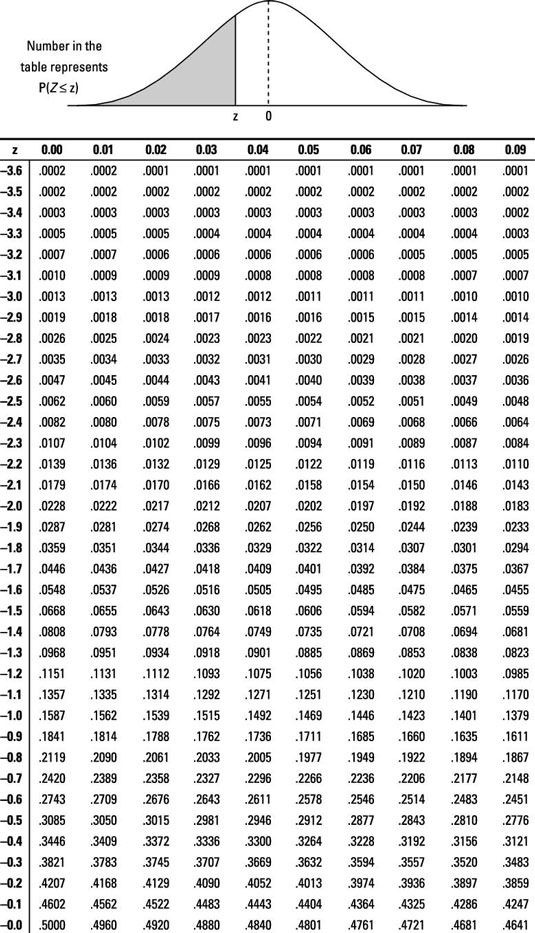
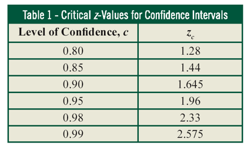



## Data

```{webr}
#| echo: false
#| auto-run: true
DataHeightSample0=read.csv("https://econ.lange-analytics.com/RData/Datasets/DataHeight.csv")
```


CL: Copy data to clipboard as backup or use `DataSample0`

```{webr}
DataHeightSample <- tribble(
  ~ID, ~Height, ~Sex,
  1,  ,"m",
  2,  ,"m",
  3,  ,"m",
  4,  ,"m",
  5,  ,"m",
  6,  ,"m",
  7,  ,"m",
  8,  ,"m",
  9,  ,"m",
  10,  ,"m",
  11,  ,"m",
  12,  ,"m",
  13,  ,"m",
  14,  ,"m",
  15,  ,"m", 
)
print(DataHeightSample)
```

## Mean

Change `Sex=="m"` to `Sex=="f"!` What happens?
```{webr}
#| message: false
#| warning: false
SDHeight=3 # known!
DataHeight=DataHeightSample0 |>
         filter(Sex=="m")
N=nrow(DataHeight)
MeanHeight=mean(DataHeight$Height)
SEHeight=SDHeight/sqrt(N)
ConfLevel=0.95
TeachHistConfInterv(MeanHeight,SEHeight, Confidence=ConfLevel, BinWidth=1, Seed=123)
cat("N:", N, "\nStand. Dev.", SDHeight, "\nSE:", SEHeight)
```


## Terminology
### Confidence Interval & Margin of Error


```{webr}
TeachHistConfInterv(MeanHeight,SEHeight, Confidence=ConfLevel, BinWidth=1, Seed=123)
CILow=round(qnorm((1-ConfLevel)/2,MeanHeight, SEHeight),1)
CIUpper=round(qnorm(1-(1-ConfLevel)/2,MeanHeight, SEHeight),1)
cat("CI LowerBound:", CILow, "| CI UpperBound:", CIUpper)
cat("N:", N, "| Stand. Dev.", SDHeight, "| SE:", SEHeight)
cat("Margin of Error ($E$):", abs(CILow-MeanHeight))
```

## Terminology
### Confidence Interval & Margin of Error


```{webr}
TeachHistConfInterv(MeanHeight,SEHeight, Confidence=ConfLevel, BinWidth=1, Seed=123)

cat("Level of Confidence:", ConfLevel)
alpha=1-ConfLevel
cat("alpha (everything else):", alpha)
cat("alpha-half (P that you check in the table):", alpha/2)
```

**z-Table**

{.nostretch width=80%}

**Confidence z-Table(use this for Hawkes and exams)**
$$\mbox{Note: } z_c=:z_{\alpha /2}$$

{.nostretch width=50%}

## Example: Constructing a Confidence Interval
A college student researching study time collects data from a random sample of 250 college students on her campus and calculates that the sample mean is  $\bar x= 15.7$ hours per week. 

If the margin of error ($E$) for her data using a 95% level of confidence is $E = 0.6$ hours, construct a 95% confidence interval for her data. Interpret your results.

## Example: Constructing a Confidence Interval 
- CI Lower Bound:
    $$CI_{Lower}=\bar x - E = 15.7 - 0.6 = 15.1$$ 

- CI Upper Bound:
    $$CI_{Upper}=\bar x + E = 15.7 + 0.6 = 16.3$$ 
- Confidence Interval
  $$CI=[15.7,16.3]$$
- Interpretation
    The true mean study time is with a probability of 95% between $15.1$ and $16.3$

## Example: Calculating Mean, Margin of Error, and CI
### Suicide Hotline

In order to estimate the number of calls to expect at a new suicide hotline, volunteers contact a random sample of $N=36$ similar hotlines across the nation and find that the sample mean is $\bar x=42.0$ calls per month. Construct a $95% $ confidence interval for the mean number of calls per month. Assume that the population standard deviation **is known** to be $SD=6.5$ calls per month.

## Example: Calculating Mean, Margin of Error, and CI {.smaller}
### Suicide Hotline

Random Sample of $N=36$ <br>
Sample mean: $\bar x=42.0$ calls per month. 
Confidence Level: $95\%$ 
Population Standard Deviation **is known**: $SD=6.5$ calls per month.

:::: {.columns}

::: {.column width="50%"}
### Steps
1. Calculate *Standard Error* ($SE$) from *Standard Deviation* ($SD$): $SE=\frac{SD}{\sqrt{N}}$
2. Find $z_{\alpha/2}$ in the *Confidence z-Table*
3. Calculate *Margin of Error* ($E$): $E=z_{\alpha/2}\cdot SE$ 
4. Use *Margin of Error* to calculate *CI*: 
    $$[\underbrace{\bar x - E}_{CI_{lower}}, 
       \underbrace{\bar x + E}_{CI_{upper}}]$$
5. Interpretation

**Confidence z-Table**
$\mbox{Note: } z_c=:z_{\alpha /2}$

{.nostretch width=75%}
:::

::: {.column width="50%"}
### Executing the Steps
1. $SE=\frac{6.5}{\sqrt{36}}=1.08$<br><br>
2. $z_{0.05/2}=1.96$
3.  $E=1.96\cdot 1.08=2.12$ <br>
4. *Confidence Interval*:
    $$[\underbrace{42 - 2.12}_{CI_{lower}}, 
       \underbrace{42 + 2.12}_{CI_{upper}}]=[39.88,44.12]$$
5. The true mean is between $40$ and $44$ calls 

```{r}
#| echo: false
#| warning: false
#| message: false
library(TeachHist)
TeachHistConfInterv(42, 1.08, BinWidth=1, SeedValue=123)
```
:::

::::

## Example: Determine Sample Size {.smaller}
### Suicide Hotline

The CEO wants a confidence level of $0.99$ and a margin of error of $1$. Consequently, the sample size needs to be increased:

$$E=z_{\alpha /2}\cdot \frac{SD}{\sqrt{N}}$$

$$\sqrt{N}=\frac{z_{\alpha /2}\cdot SD}{E}$$

$$N=\left (\frac{z_{\alpha /2}\cdot SD}{E} \right )^2$$

$$N=\left (\frac{2.575\cdot 6.5}{1} \right )^2= 280$$

**Confidence z-Table**
$\mbox{Note: } z_c=:z_{\alpha /2}$

{.nostretch width=50%}

# Proportions

## Example: Calculating Proportions, Margin of Error, and CI
### Proportion Students Not Enough Parking

A survey of $345$ University students found that $301$ students think that there is not enough parking. Find the $90\%$ confidence interval for the proportion of all universities students who think that there is not enough parking on campus. 

## Example: Calculating Proportions, Margin of Error, and CI {.smaller}
### Proportion Students Not Enough Parking

Random Sample of $N=345$ <br>
Proportion: $\hat p=\frac{301}{345}=0.872$  <br>
Normal distributed? **Yes**: $5<n \hat p= 345\cdot 0.872$ and $5<n (1-\hat p)= 345\cdot 0.128$ <br>
Confidence Level: $90\%$ 

:::: {.columns}

::: {.column width="50%"}
### Steps
1. Calculate *Standard Error* ($SE$): 
    $$SE=\sqrt{\frac{\hat p(1-\hat p)}{N}}$$
2. Find $z_{\alpha/2}$ in the *Confidence z-Table*
3. Calculate *Margin of Error* ($E$): $E=z_{\alpha/2}\cdot SE$ 
4. Use *Margin of Error* to calculate *CI*: 
    $$[\underbrace{\hat p - E}_{CI_{lower}}, 
       \underbrace{\hat p + E}_{CI_{upper}}]$$
5. Interpretation

**Confidence z-Table**
$\mbox{Note: } z_c=:z_{\alpha /2}$

{.nostretch width=75%}
:::

::: {.column width="50%"}
### Executing the Steps
1. $SE=\sqrt{\frac{0.872\cdot 0.128}{345}}=0.018$
<br><br><br><br>
2. $z_{0.1/2}=1.645$
3.  $E=1.645\cdot 0.018=0.030$ <br>
4. *Confidence Interval*:
    $$[\underbrace{0.872 - 0.03}_{CI_{lower}}, 
       \underbrace{0.872 + 0.03}_{CI_{upper}}]=[0.842,0.902]$$
5. The true proportion of students (not enough parking) is between $87\%$ and $90\%$

```{r}
#| echo: false
#| warning: false
#| message: false
library(TeachHist)
TeachHistConfInterv(87.2, 1.8, BinWidth=1, SeedValue=123, Confidence=0.9)
cat("Note, proportions in %-points")
```
:::

::::

## Example: Determine Sample Size {.smaller}
### Proportion Students  Not Enough Parking

The University President wants a margin of error of $1\%$ (everything else the same). Consequently, the sample size needs to be increased:

$$E=z_{\alpha /2}\cdot \sqrt{\frac{\hat p(1-\hat p)}{N}}$$

$$\sqrt{N}=\frac{z_{\alpha /2}\cdot \sqrt{\hat p(1-\hat p)}}{E}$$

$$N=\frac{z_{\alpha /2}^2\cdot \hat p(1-\hat p)}{E^2}$$

$$N=\frac{1.645^2\cdot 0.872 \cdot 0.128}{0.01^2}=3020$$

**Confidence z-Table**
$\mbox{Note: } z_c=:z_{\alpha /2}$

{.nostretch width=50%}

# What if Standard Devaition Is Not Known But Estimated?

## Standard Deviation Estimated from The Sample

<br><br>
**In most practical cases**, the *Population Standard Deviation* **is unknown**. Then it **needs to be estimated** as the *Sample Standard Deviation*.
<br><br>
**As a consequence**:

You must use the **t-Distribution (use the t-Table)** instead of using the **z-Distribution (use the z-Table)**

## t-Distribution vs. Normal Distribution
<br><br>
**If the Standard Deviation is not known and is estimated from the sample:** <br> Normal Distribution changes to a t-Distribution
<br><br>
**However, Normal Distribution and t-Distribution are very similar with the t-Distribution having fatter tails.**


## t-Distribution vs. Normal Distribution 
### $N=10$, $d.f.=9$, $Mean=0$, $SD=1$

```{r}
#| echo: false

# Set parameters
N <- 10
df <- N - 1
mu <- 0
sigma <- 1

# Generate a sequence of x values from -4 to 4
x_values <- seq(-4, 4, length.out = 1000)

# Create a data frame containing densities for both distributions
df_plot <- data.frame(
  x = rep(x_values, 2),
  density = c(dnorm(x_values, mean = mu, sd = sigma), 
              dt(x_values, df = df)),
  distribution = rep(c("Normal (0, 1)", paste0("t-distribution (df = ", df, ")")), 
                     each = 1000)
)

# Generate the ggplot
ggplot(df_plot, aes(x = x, y = density, color = distribution)) +
  geom_line(linewidth = 1) +
  scale_color_manual(values = c("Normal (0, 1)" = "#E41A1C", 
                                "t-distribution (df = 9)" = "#377EB8")) +
  labs(
    title = paste("Comparison of Normal and t-Distribution (N =", N, ")"),
    subtitle = "The t-distribution has fatter tails but approaches the normal as d.f. increases",
    x = "Value",
    y = "Density",
    color = "Distribution Type"
  ) +
  theme_minimal() +
  theme(legend.position = "bottom")
```

## t-Distribution vs. Normal Distribution 
### $N=25$, $d.f.=24$, $Mean=0$, $SD=1$

```{r}
#| echo: false

# Set parameters
N <- 25
df <- N - 1
mu <- 0
sigma <- 1

# Generate a sequence of x values from -4 to 4
x_values <- seq(-4, 4, length.out = 1000)

# Create a data frame containing densities for both distributions
df_plot <- data.frame(
  x = rep(x_values, 2),
  density = c(dnorm(x_values, mean = mu, sd = sigma), 
              dt(x_values, df = df)),
  distribution = rep(c("Normal (0, 1)", paste0("t-distribution (df = ", df, ")")), 
                     each = 1000)
)

# Generate the ggplot
ggplot(df_plot, aes(x = x, y = density, color = distribution)) +
  geom_line(linewidth = 1) +
  scale_color_manual(values = c("Normal (0, 1)" = "#E41A1C", 
                                "t-distribution (df = 24)" = "#377EB8")) +
  labs(
    title = paste("Comparison of Normal and t-Distribution (N =", N, ")"),
    subtitle = "The t-distribution has heavier tails but approaches the normal as df increases",
    x = "Value",
    y = "Density",
    color = "Distribution Type"
  ) +
  theme_minimal() +
  theme(legend.position = "bottom")
```

## Example: Calculating Mean, Margin of Error, and CI 
### Average Age of College Students

Somebody wants to find the average age at a university with $20,000$ students and surveys a group of $100$ students. The mean of the sample is $25$ and the *Sample Standard Deviation* is estimated as $5$.

Design a confidence interval so that the chance that it contains the population mean (the average age of all the students of the university) is $95\%$.


## Example: Calculating Mean, Margin of Error, and CI {.smaller}
### Average Age of College Students

Random Sample of $N=100$ <br>
Sample mean: $\bar x=25$ years <br>
Confidence Level: $95\%$ ($\alpha=0.05$ and $\alpha /2=0.025$)<br>
***Sample Standard Deviation* is estimated** as $SD=5$<br>


:::: {.columns}

::: {.column width="50%"}
### Steps
1. Calculate *Standard Error* ($SE$) from *Standard Deviation* ($SD$): $SE=\frac{SD}{\sqrt{N}}$
2. Find $t_{\alpha/2}$ in the *t-Table* for Degree of Freedom <br>
($d.f.=N-1$)
3. Calculate *Margin of Error* ($E$): $E=t_{\alpha/2}\cdot SE$ 
4. Use *Margin of Error* to calculate *CI*: 
    $$[\underbrace{\bar x - E}_{CI_{lower}}, 
       \underbrace{\bar x + E}_{CI_{upper}}]$$
5. Interpretation

**t-Table**<br>
Left Tail<br>
{.nostretch width=75%}
:::

::: {.column width="50%"}
### Executing the Steps
1. $SE=\frac{5}{\sqrt{100}}=0.5$<br><br>
2. $t_{0.025}=1.984$<br>
($d.f.=100-1 \approx 100$)
3.  $E=1.984\cdot 0.5=0.992$ <br>
4. *Confidence Interval*:
    $$[\underbrace{25 - 0.992}_{CI_{lower}}, 
       \underbrace{25 +0.992}_{CI_{upper}}]=[24,26]$$
5. The true mean is between $24$ and $26$ years 

```{r}
#| echo: false
#| warning: false
#| message: false
library(TeachHist)
TeachHistConfInterv(25, 0.5, BinWidth=1, SeedValue=123)
```
:::

::::
