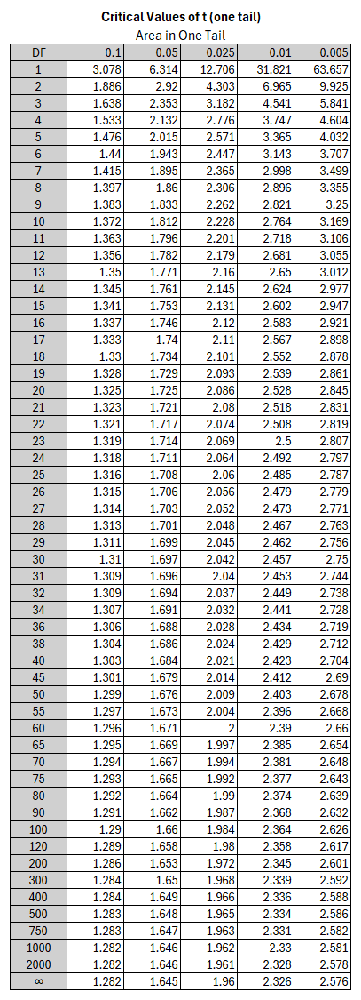



## The Idea of a Hypothesis Test 

::: {.incremental}
1. We use a **hypothesis that we do not believe in**, and we **pretend it is true**.
2. Then we **use data** to show that **it is very unlikely that hypothesis is true**.
:::

## Searching for a Contradiction

### The Logic of a Hypothesis Test

**The Assumption: **
: We start with a claim we actually doubt (**Null Hypothesis**).<br><br>

**The "Pretend" Phase:**
: We act as if that claim is true.<br><br>

**The Reality Check:**
: We look at our **data** and hope to deduct that the **assumption (Null Hypothesis is unlikely to be true**.

## Example: We believe a Scale is not measuring Precisely 

A meat-packing department of a large grocery store packs ground beef in 2-pound portions. **They are concerned that their machine is no longer packaging the beef to the required specifications.** <br>

To test the claim that the average weight of ground beef packed is not 2 pounds, the store measures the average weight for 20 packages of beef with a high precision scale. <br>

The sample mean is 2.10 with a standard deviation of 0.33 pounds. <br>

Is there evidence at the 0.95 level of significance that the machine is not working properly? <br>

Assume that the weights are normally distributed.

## Example: We believe a Scale is not measuring Precisely

### The Assumption that we doubt (Null Hypothesis):

$$\mu=2$$

### Alternative (Research Hypothesis) from the Data:

$$\mu \neq 2$$

## The "Pretend" Phase: {.smaller}

We act as if the **Null Hypothesis claim is true** and use the *Standard Error* from the data sample as an estimate for the true *Standard Error*:

$$SE=\frac{0.33}{\sqrt{20}}=0.07$$

```{r}
#| echo: false
library(TeachHist)
MyPlot=TeachHist::TeachHistConfInterv(SampleMean=2, StandardError = 0.07, DegreeFreedom=19, IsSdEstimated=TRUE)
```

If the Null Hypothesis ($\mu=2$) is true and we assume 0.95% confidence the sample mean should fall somewhere in the $0.95$ confidence interval in 95% of all cases (it would be outside of the confidence interval in only 5% of the cases which is considered unlikely)

## Hypothesis Test {.smaller}

::::: columns
::: {.column width="50%"}
### Steps

**Standard Deviation is estimated from sample =\> t-table**

$$\alpha=1-0.95=0.05$$

$$\alpha/2=0.05/2=0.025$$

$$d.f=20-1=19$$

$$t_{\alpha/2}=2.093$$

If our sample mean is between $-2.093$ and $+2.093$ Standard Errors away from the (assumed) mean, then it could have happened by chance and we cannot reject the hypothesis that the mean is $\mu=2$.
:::

::: {.column width="50%"}
### t-Table



:::
:::::

## Is our Sample mean between +/- 2.093 Standard Errors Away from the Mean? {.smaller}

**Does our sample t-value lie outside the non-rejection zone?**

```{r}
#| echo: false
TeachHistHypTest(NullHyp=2, StandardError = 0.07, SampleMean =2.1,  DegreeFreedom = 19, IsSdEstimated = TRUE)
```

$$t_{Sample}=\frac{2.1-2}{\frac{0.33}{\sqrt{20}}} = 1.36$$

We cannot reject the Null Hypothesis. The deviation from 2 might be accidental.

## One Tailed Hypothesis Tests {.smaller}

Nurses in a large teaching hospital have complained for many years that they are overworked and understaffed. 

The **consensus** among the nursing staff is that they average **at least 8 patients** per nurse each shift. 

The **hospital administrators claim that the average is lower than 8**. 

In order to prove their point to the nursing staff, the administrators gather information from **19 nurses**. The **sample mean is 7.5 with a standard deviation of 1.1 patients**. 

Test the administrators’ claim for a confidence level of 95% and assume that the average number of patients per nurse follows a normal distribution.

## One Tailed Hypothesis Tests {.smaller}
### Null Hypothesis, Research Hypothesis, Sample Statistics

#### The Assumption that the researcher doubts (Null Hypothesis):

$$\mu>=8$$

#### Alternative (Research Hypothesis) from the Data:

$$\mu < 8$$

#### Data

$$\alpha=1-0.95=0.05$$

$$SE=\frac{1.1}{\sqrt{19}}=0.25$$

$$d.f.=19-1=18$$

$$\bar x=7.5$$


## One Tailed Hypothesis Tests {.smaller}
### Result Graph

```{r}
#| echo: false
TeachHistHypTest(NullHyp=8, StandardError = 0.25, SampleMean =7.5,  DegreeFreedom = 18, IsSdEstimated = TRUE, TestType="LeftTail")
```

## Hypothesis Test {.smaller}

::::: columns
::: {.column width="50%"}
### Steps

$$\alpha=1-0.95=0.05$$


$$d.f=19-1=18$$

$$t_\alpha=-1.734$$

If our sample mean less than $-1.734$ Standard Errors away from the (assumed) mean, then it could have happened by chance and we cannot reject the hypothesis that the mean is $\mu=8$.
:::

::: {.column width="50%"}
### t-Table


:::
:::::

## Is our Sample mean less than -1.734 Standard Errors Away from the Mean? {.smaller}

**Does our sample t-value lie outside the non-rejection zone?**

```{r}
#| echo: false
TeachHistHypTest(NullHyp=2, StandardError = 0.07, SampleMean =2.1,  DegreeFreedom = 19, IsSdEstimated = TRUE)
```

$$t_{Sample}=\frac{7.5-8}{\frac{1.1}{\sqrt{19}}}=\frac{-0.5}{0.25} = -1.36$$

We cannot reject the Null Hypothesis. The deviation from 2 might be accidental.
