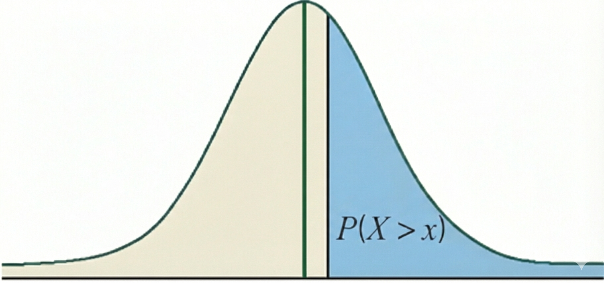
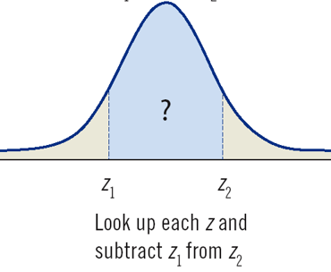



## What Will You Learn

-   You will use the *Normal Distribution* to predict individual normal distributed variables.

-   You will use the *Normal Distribution* to answer questions like:

    -   What is the probability to get a value smaller than $x$?
    -   What is the probability to get a value greater than $x$?
    -   What is the probability to get a value between $x_1$ and $x_2$?
    -   Which value is **not exceeded** by 95% of subjects?   
    -   Which value is **exceeded** by 1% of subjects?

## Frequentist Approach

::: callout-note
## **Goal:**

**Understand probabilities based on data for topics, <br>where we do not know the theory well enough.**
:::

<br>
**Example Body Temperature:**

-   We can estimate the **mean** from data
-   We can estimate the **standard deviation** from data
-   We can reasonably assume that temperature is **normal distributed**

## Normal Distributed Data {.smaller}

-   Most values are close to the mean
-   Some are larger or smaller than the mean
-   Few are a lot larger or a lot smaller than the mean
-   Very few are extremely large or extremely small
-   The distribution is symmetric around the mean

A **bell curve** with useful properties is the **Gaussian Curve**:

$$
Density = \frac{1}{\sqrt{2\pi\sigma^2}} e^{-\frac{(x - \mu)^2}{2\sigma^2}}
$$

## Gaussian Curve/Normal Curve {.smaller}

A bell curve with useful properties is the Gaussian Curve:

$$
Density = \frac{1}{\sqrt{2\pi\sigma^2}} e^{-\frac{(x - \mu)^2}{2\sigma^2}}
$$

where: 

- $\pi=3.1415$ and $e=2.7183$ are constants 
- $\mu$ is the mean and $\sigma$ is the standard deviation

**Consequently**, when we are able to estimate the **mean** and **standard deviation**, we can assign a $Density$ to each value of interest ($x$) and draw the curve.<br><br>

> **The area left of $x$ shows the probability of a value smaller (or equal) than $x$**

## Example: Body Temperature  Smaller 100F for Healthy Adults {.smaller}

**Est. Mean:** $98.2$

**Est. Standard Deviation:** $0.7$

:::: columns

::: {.column width="20%"}

:::

::: {.column width="60%"}

```{webr}
#| auto-run: true
#| echo: false
#| message: false
#| warning: false

source("https://econ.lange-analytics.com/RScripts/ZTable4Digits.R")


P=pnorm4(100, 98.2, 0.7)
cat("Probability (rounded) for a body temperature smaller than 100F:", P)
```

:::

::: {.column width="20%"}

:::

::::

## Example: Body Temperature Smaller 100F for Healthy Adults {.smaller}

:::: columns

::: {.column width="50%"}

**Temperature Axis**

```{webr}
#| message: false
#| warning: false
P=pnorm4(100, 98.2, 0.7)
cat("Probability (rounded) for a body temperature smaller than 100F:", P)
```


:::

::: {.column width="50%" .smaller}

**Standard Deviation Axis** 

$z:=\mbox{How Many Std. Deviations from Mean}$ <br>
$$z=\frac{x-Mean}{StdDev}$$

$$z=\frac{100F-98.2F}{0.7F}=2.57$$

$$P_{X<100F}=0.9949$$


:::

::::

## Example: Body Temperature Greater 100F for Healthy Adults {.smaller}

:::: columns

::: {.column width="50%"}

**Temperature Axis**

```{webr}
#| message: false
#| warning: false
P=1-pnorm4(100, 98.2, 0.7)
cat("Probability (rounded) for a body temperature greater than 100F:", P)
```



:::

::: {.column width="50%" .smaller}
**Standard Deviation Axis** 

$z:=\mbox{How Many Std. Deviations from Mean}$ <br>
$$z=\frac{x-Mean}{StdDev}$$

$$z=\frac{100F-98.2F}{0.7F}=2.57$$

$$P_{X<100F}=0.9949$$

$$P_{X>100F}=1-0.9949=0.0051$$


:::

::::

## Body Temp. between 98.0F and 98.4F for Healthy Adults {.smaller}

:::: columns

::: {.column width="50%"}

**Temperature Axis**

```{webr}
#| message: false
#| warning: false
P2=pnorm4(98.4, 98.2, 0.7)
cat("Probability (rounded) for a body temperature smaller than 98.4F 100:", P2)
P1=pnorm4(98, 98.2, 0.7)
cat("Probability (rounded) for a body temperature smaller than 98F:", P1)
cat("--------------------------------------------")
cat("P2 - P1:", P2 - P1)
```



:::

::: {.column width="50%" .smaller}

**Standard Deviation Axis** 

$$z_2:=\mbox{How Many Std. Dev. from Mean}$$

$$z_2=\frac{x-Mean}{StdDev}$$

$$z_2=\frac{98.4F-98.2F}{0.7F}=0.29$$

---

$$z_1:=\mbox{How Many Std. Dev. from Mean}$$

$$z_1=\frac{x-Mean}{StdDev}$$

$$z_1=\frac{98F-98.2F}{0.7F}=-0.29$$

---

$$P_2-P_1 = 0.6141 - 0.3859 = 0.2282$$


:::

::::

## Example: Body Temp. "Not Exceeded" by 95% of Healthy Adults {.smaller}

:::: columns

::: {.column width="50%"}

**Temperature Axis**


```{webr}
#| message: false
#| warning: false
Q=qnorm4(0.95, 98.2, 0.7)
cat('Body Temperature (rounded) not exceeded by 95% of healthy adults:', Q, "F")
```


:::

::: {.column width="50%" .smaller}

**Standard Deviation Axis** 

Find probability closest to $P=0.95$ inside the z-table and then find the z-value that is related to it ($z_{0.9495}=1.64$). 

Calculate with *z-value* formula:
$$z=\frac{x-Mean}{StdDev}  \Longleftrightarrow x= z \cdot StdDev + Mean$$

$$x= 1.64 \cdot 0.7F + 98.2F = 99.348F$$

---

A more logical way:

1. Find probability closest to $P=0.95$ inside the z-table
2. Find the related $z$-value ($z_{0.9495}=1.64$)
3. $z:=\mbox{How Many Std. Deviations from Mean}$<br>   
   $P=0.95$ is $1.64$ Std. Deviations from the Mean
4. Therefore, $1.64 \cdot 0.7 = 1.148$ <br>
   Thus, $P=0.95$ is $1.148F$ from the Mean
5. $1.148F + Mean= 1.148F + 98.2F = 99.348F$
6. Finally, $99.348F$ is not exceeded by $95%$ of healthy adults.


:::

::::

## Example: Body Temperature "Exceeded" by 1% of Healthy Adults {.smaller}

::: callout-note

## **Hint:**
The temperature that is **exceeded** by 1% of healthy adults, is the same temperature that is **not exceeded** by 99% of adults.

:::

:::: columns

::: {.column width="50%"}

**Temperature Axis**


```{webr}
#| message: false
#| warning: false
Q=qnorm4(0.99, 98.2, 0.7)
cat('Body Temperature (rounded) not exceeded by 99% of healthy adults:', Q, "F")
```


:::

::: {.column width="50%" .smaller}

**Standard Deviation Axis** 

Find probability closest to $P=0.99$ inside the z-table and then find the z-value that is related to it ($z_{0.9901}=2.33$). 

Calculate with *z-value* formula:
$$z=\frac{x-Mean}{StdDev}  \Longleftrightarrow x= z \cdot StdDev + Mean$$

$$x= 2.33 \cdot 0.7F + 98.2F = 99.831F$$

---

A more logical way:

1. Find probability closest to $P=0.99$ inside the z-table
2. Find the related $z$-value ($z_{0.9901}=2.33$)
3. $z:=\mbox{How Many Std. Deviations from Mean}$<br>   
   $P=0.99$ is $2.33$ Std. Deviations from the Mean
4. Therefore, $2.33 \cdot 0.7F = 1.631F$ <br>
   Thus, $P=0.99$ is $1.631F$ from the Mean
5. $1.631F + Mean= 1.631F + 98.2F = 99.831F$
6. Finally, $99.831F$ is **not exceeded** by $99%$ of healthy adults and consequently, $99.831F$ is **exceeded** by $1%$ of healthy adults


:::

::::