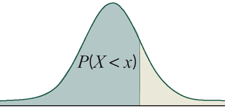
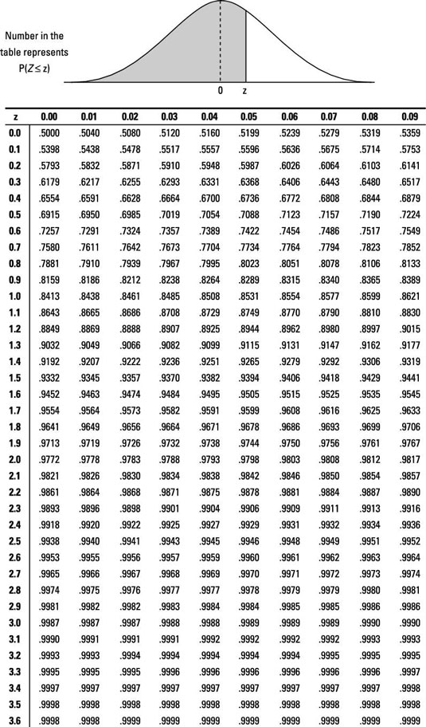

## Example: Body Temperature Not Exceeded by 95 of Healthy Adults {.smaller}

:::: columns

::: {.column width="50%"}

**Temperature Axis**


```{webr}
#| message: false
#| warning: false
Q=qnorm4(0.95, 98.2, 0.7)
cat('Body Temperature (rounded) not exceeded by 95% of healthy adults:', Q)
```



:::

::: {.column width="50%" .smaller}

**Standard Deviation Axis**

1. Find probability closest to $0.95$ inside the z-table.
2. Find the related $z$-value ($z_{123}=xxx$)
3. $z:=\mbox{How Many Std. Deviations from Mean}$ 
$z=\frac{x-Mean}{StdDev} \Longleftrightarrow x= z \cdot StdDev + Mean$
$P=0.95$ is xxx Std. Deviations from the Mean
4. $xxx \cdot 0.7 = xxx$ is xxx F from the Mean
5. $xxx + Mean= xxx + 98.2 = xxx$


$$z=\frac{100-98.2}{0.7}=2.57$$




:::
::::

