## Two Parts of the Presentation
<br><br>

-   How does Generative AI (*genAI*) work?
<br>
-   Use cases and demos for *genAI*!

## Why is it important to know how genAI/LLMs work???
<br><br>

-   For effective use<br>
<br>
-   To identify possible dangers


## Stylized Example: Time travel with a TV  to the year 1885 {.smaller}

::: {.column width="40%"}
**Perception**

-   Excitement

-   Little artificial people inside the box are staging a play
:::

::: {.column width="58%"}
{fig-alt="A TV displaying a western"}
:::


## Stylized Example: Time travel with a TV  to the year 1885 {.smaller}

::: {.column width="40%"}
**Dangers without Technology Background**

-   What if something gets out of the TV box

-   ~~People watch to much TV and do not socialize enough~~
:::

::: {.column width="50%"}
{fig-alt="A TV displaying a western with bullets flying out of it"}
:::

## Stylized Example: Time travel with a TV  to the year 1885 {.smaller}

::: {.column width="42%"}
**Dangers with Technology Background**

TVs are just an arrangement of millions of colored pixels and our eye/brain processes them to a picture

-   ~~What if something gets out of the TV box~~

-   **People watch to much TV and do not socialize enough**
:::

::: {.column width="55%"}
{fig-alt="A TV displaying a western with bullets flying out of it"}
:::

## Outcomes {.scrollable .smaller}


::: {.incremental}
- How **genAI**  fits in the **AI** Landscape

-   Word encoding **Tokenization and Embedding** of the English language

- What is a **Neural Network**

-   How the words position in a prompt can be coded (**Positional Encoding**)<br> `Dog bites child` but `Child bites dog`

-   How attention of words in a prompt can be encoded (*Attention Mechanism*)<br> "The cat sits on the `mat` because `it` is soft"

-   fine tuning *LLMs* to specialize  and to avoid discrimination, derogatory language, and racism

-   Demos of *genAI*

:::

## *AI* vs. *Machine Learning* vs. *genAI/LLMs* {.smaller}

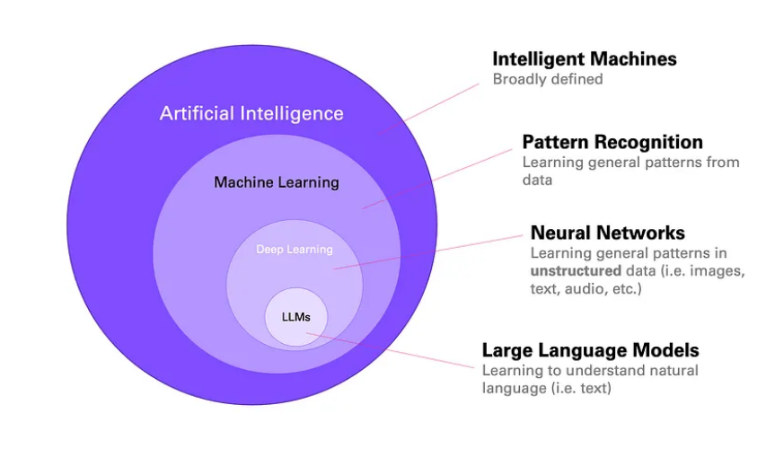 

## History of Generative AI {.smaller}

**2003:** Bengio, Y., Neural Probabilistic Language Models (very basic)

**2014:** Sutskever, I.: Recurrent Neural Networks - LSTM (mainly used for translation; slow and not easy to parallelize)

**2014:** Bahdanu, D.: Still Recurrent Neural Networks but with Attention - LSTM (still slow and not easy to parallelize, but more powerful)

**2017:** Google Team, "Attention is All you Need", Transformer Model (powerful, fast, and can be parallelized; with  modifications still used in 2025)

[Source: Andre Karpathy, http://youtube.com/watch?v=XfpMkf4rD6E]{style="font-size:70%"}

**2017 -- Now:** Many advancements in the core model, fine tuning, and interaction capabilities. However, most *GenAI* models are still based on *Transformer Models*

## Computer Cannot Process Words Only Numbers

::: {.column width="30%"}
**3.2\*dog-0.1\*cat=???**
:::

::: {.column width="10%"}
.
:::

::: {.column width="42%"}
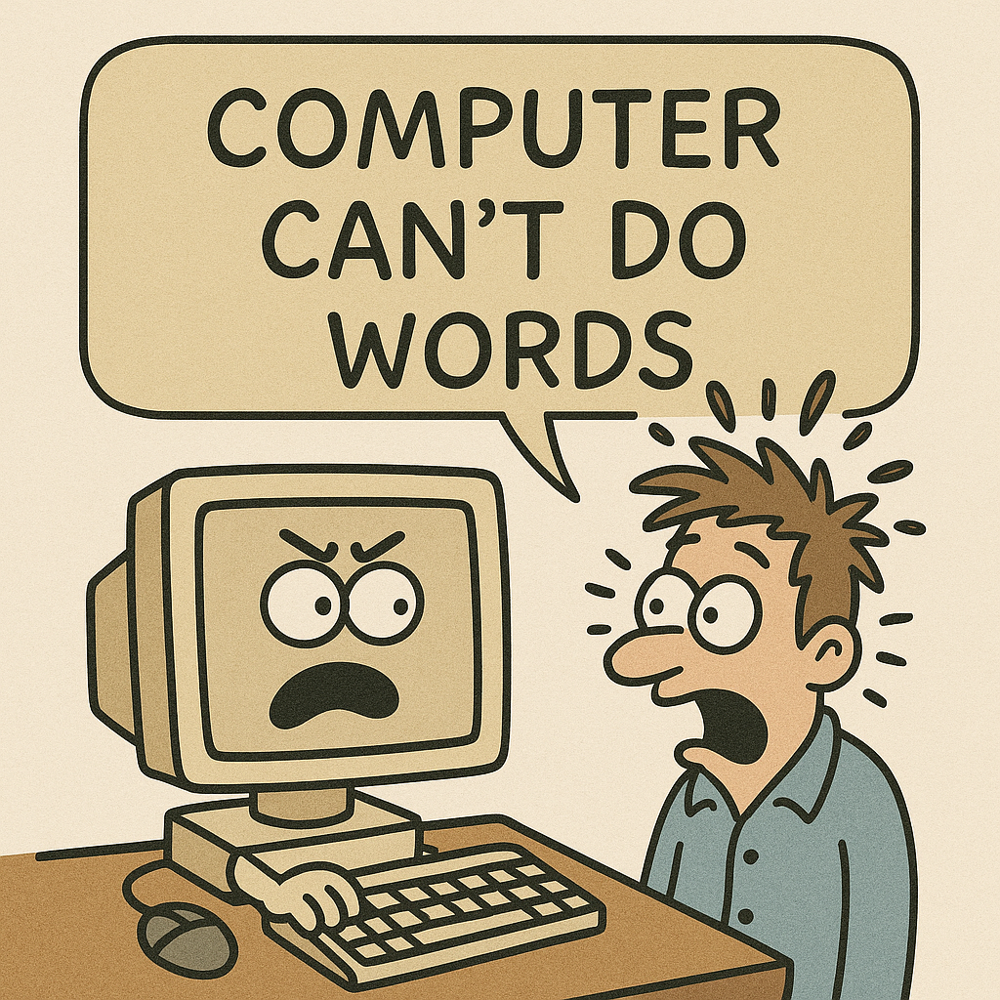 
:::


## 1963 ASCII-Code Converted Letters to Numbers {.smaller}


::: {.column width="50%"}

#### ASCII

*ASCII* code was introduced in 1963 to code letters and special characters as (binary) numbers.

Today we use *Unicode* which includes several fonts and emojis but is similar to *ASCII*


:::

::: {.column width="42%"}
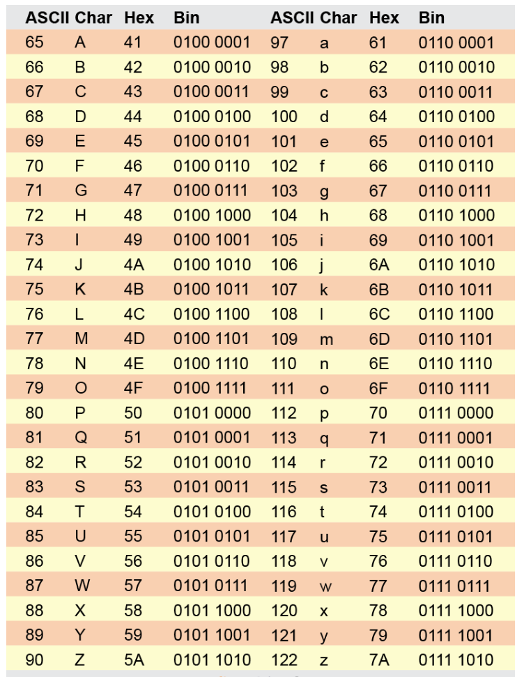{fig-alt="Source: Understanding the ASCII Table"}
:::

::: footer
[Understanding the ASCII Table](https://linuxhint.com/understanding-ascii-table/)
:::

Note, Unicode is similar to ASCII

## Problem with ASCII and Unicode

-   Letters have no meaning
-   Teaching a computer to develop meaning from a combination of letters (a.k.a. "words") is very difficult

**Solution:** <br>We need to code **words** into **lists of numbers (tokens)**

## Decisions to be Made

-   which words are frequent enough to deserve an own token

-   which sub-word are frequent enough to deserve an own token

Machine learning models have been trained on that problem with Internet content:

**Two sentences to be tokenized (see link in footer)**: 

-   "Untrained horses eat apples, but apples do not eat untrained horses"

-   "Cal Poly Pomona is sometimes called CPP" 

Note, token IDs sort tokens according to their frequency in the English language (most frequent first) but they are not used to code words.

::: footer
[OpenAI Tokenizer for GPT-4o & GPT-4o mini](https://platform.openai.com/tokenizer){target="_blank"}
:::

## We have Tokens, but how do we convert them to numbers?

**<br><br>Using their ID is not a good idea!**<br><br>

**Simplification for Teaching:**

-   each word in the English language (200,000) becomes a token <BR>
(no sub-tokens)
-   words are sorted alphabetically not by their ID

## We have Tokens, but how do we convert them to numbers? {.smaller}

::: {.column width="65%"}
**One Hot Encoding**

A vector (a list) with the length of the tokens for the language is created (e.g., for English, about 200,000 words/tokens)

The value for all words/tokens is zero with the exception of the word/token of interest (One-Hot)
:::

::: {.column width="5%"}

:::

::: {.column width="30%"}
**"Neural Network"**

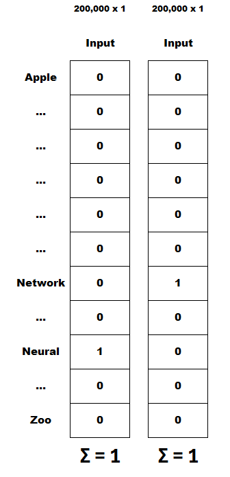
:::

## Ridiculous Simple Example - untrained (Guess the Next Word) {auto-animate="true"}

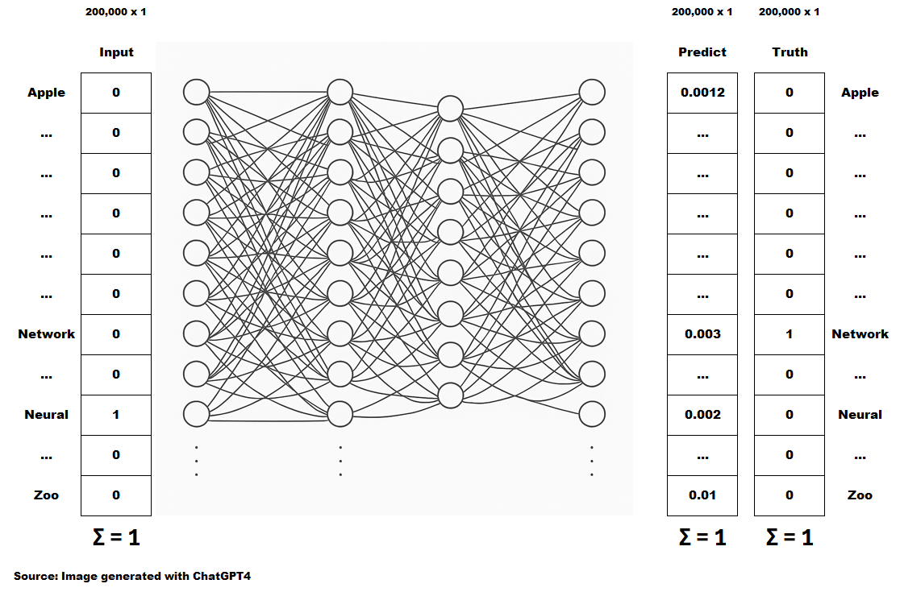

## Ridiculous Simple Example - untrained (Guess the Next Word) {auto-animate="true"}

{width="166" height="106"}


## Ridiculous Simple Example - trained (Guess the Next Word)  {auto-animate="true"}

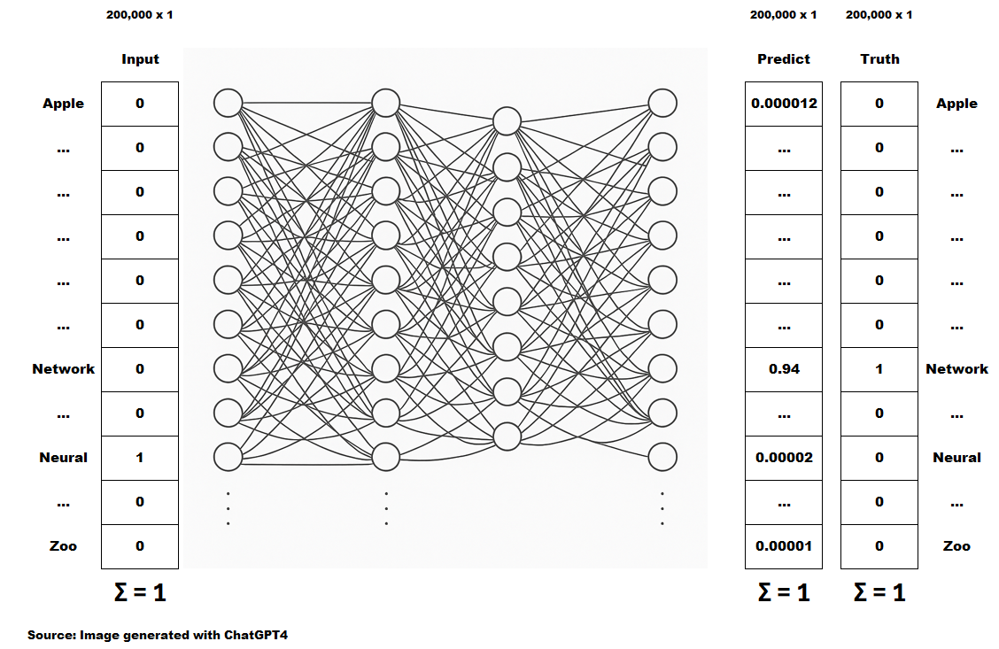


## Problems with the Simple Example   {.smaller}


::: columns
::: {.column width="80%"}
### Problems and Solutions ●● ●●XX


1.  *One-Hot Encoding* is wasteful (e.g., the word "neural": A list with 200,000 numbers all 0 except the position for "neural" being 1)
1.  One-Hot Vectors have **no semantics**. E.g., `neural` and `network` are not similarly encoded.<br> **Solution to 1) and 2):** `Word Embedding`. 
2.  The prompt has only one word. A prompt with more words needs information about the order of words.<br> **Solution:** `Positional Encoding`
3.  When the prompt has more words, we also need **Attention.** <br>E.g.: <br> `The animal didn't cross the street because it is too tired`<br> or <br> `The animal didn't cross the street because it is too wide`<br> **Solution:** `Attention` (stores for each word which words from the prompt are important and which are not)
:::

::: {.column width="20%"}
### Simple Model:


:::
:::


## What we want from an LLM  {.smaller}

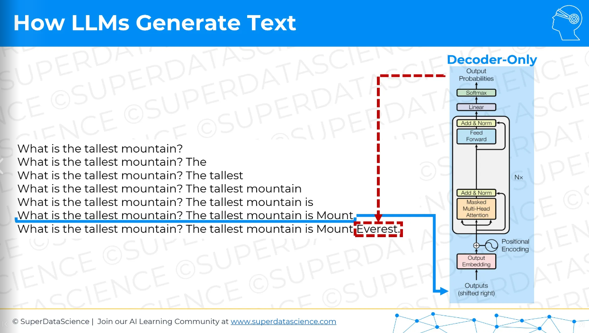

Source: [https://online.fliphtml5.com/grdgl/qhfw/#p=12](https://online.fliphtml5.com/grdgl/qhfw/#p=12){target="Blank_"}


## Word Embedding to Provide Meaning/Semantic

`King - Man + Women = ???`

. . .

`King - Man + Women = Queen`

. . .

<small>Similar words should have similar encoding vectors:<br><br> `great` should be similar to `amazing`. The input vector for `tomato` should be similar to the one for `apple`, and the input vectors for `queen` and `king` should also be similar.</small>


## Word Embedding into 512 Categories: Hire a Linguist to do the Word Embedding

The linguist performs *Word Embedding* into 512 categories of their choice.

This method is prohibitively slow but bear with me.

## Hire a Linguist - Possible Word Embeddings {.smaller}

Below are possible *Word Embeddings* for `apple`, `tomato`, `queen`, `king`, `amazing`, `great`

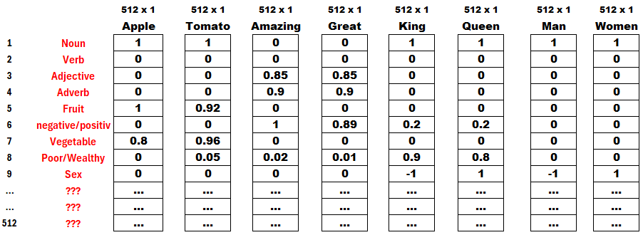

## Word Embedding into 512 Categories:  Use a Neural Network - Possible Word Embeddings {.smaller}

Below are possible *Word Embeddings* for `apple`, `tomato`, `queen`, `king`, `amazing`, `great`

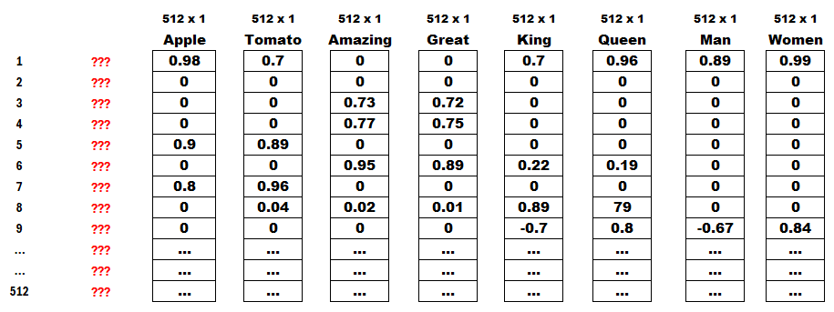

## Word Embedding with Bag of Words {.smaller}


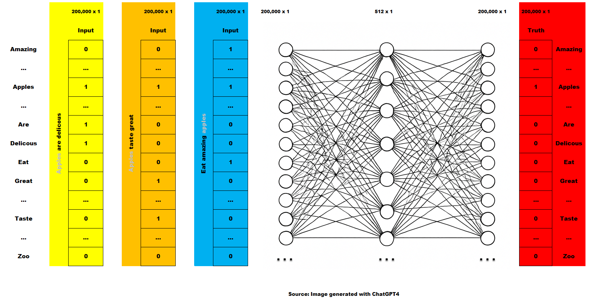

## Word Embedding Real World Example {.smaller}

#### Covid Twitter Feed

[https://colab.research.google.com/drive/10AiswVTzzgr7dlJJEe_t3Pgm3evbGtzP#scrollTo=-chXmtjNVNbz](https://colab.research.google.com/drive/10AiswVTzzgr7dlJJEe_t3Pgm3evbGtzP#scrollTo=-chXmtjNVNbz){target="_blank"}

The file `Corona_NLP_train.csv` needs to be uploaded first (see folder symbol left panel)

●● ●● ●●  XXX

## Storing the Position of Words in the Prompt


**Transformers** process all tokens simultaneously, thus **losing the order of the words in the prompt**, if not stored otherwise (**Positional Encoding**).


## Generate Position-Aware Embedding 

Tokens of a prompt without positional encoding:<br> \[bit, child, dog\]<br>

Is it: "child bit dog"

or

is it: "dog bit child"

. . .

After adding positional encoding, it is clear: \[bit (2), child (3), dog (1)\]

. . .

Word positions are also stored in a vector (list of numbers) with the same length of the word embedding. They are then added to the embedding vector (list of numbers)


::: footer
[Details: Positional Encoding Explained](https://medium.com/thedeephub/positional-encoding-explained-a-deep-dive-into-transformer-pe-65cfe8cfe10b){target="_blank"}
:::


## Generate Position-Aware Embedding 
### Add Position 2 to the Embedding of `bit` {.smaller}

Add a *Position-Vector* (512 x 1) to each word embedding (512 x 1).

The *Position-Vector* reflects the word position of the word `bit` in the prompt


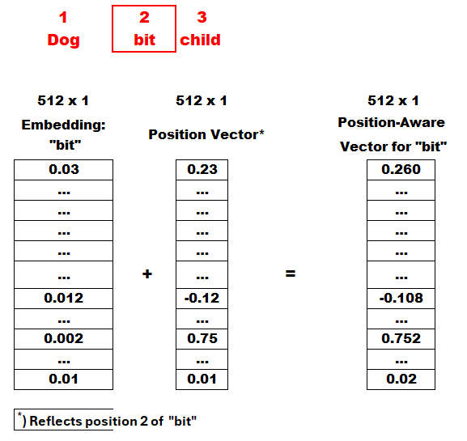

## How Positional Encoding Works

[Excel: How we count](Counting.xlsx){target="_blank"}

[Details: Positional Encoding Explained](https://medium.com/thedeephub/positional-encoding-explained-a-deep-dive-into-transformer-pe-65cfe8cfe10b){target="_blank"}

## Prompt Sizes (Positions to Encode) in LLM {.smaller}

| Era | Model Name | Context Window (Tokens) | Approx. Pages  |
|:---|:---|:---:|:---:|
| **Current** | Gemini 3 Pro | 1M  | 1000 |
| **Current** | Llama 4 Scout | 10M | 10,000 |
| **Current** | Claude 4.6  | 200K | 200 |
| **Current** | GPT-5  |  400K | 400 |
| **Current** | DeepSeek-R1 | 128K | 128 |
| **Legacy** | GPT-4 Turbo | 128K | 128 |
| **Legacy** | Claude 1  | 100K | 100 |
| **Legacy** | GPT-2 | 1024 | 1 |

: Comparison of LLM Prompt Sizes (2020-2026) {#tbl-llm-sizes}


## Step 3: Adding Attention

**Example 1:**<br>The **animal** didn’t cross the road because **it** was too **tired**.

**Example 2:**<br>The animal didn’t cross the **road** because **it** was too **wide**.

Step 3 identifies for each word in the prompt other words in the prompt that are relevant (**Attention**)

Simplified:

**In Example 1** the word **it** points to **animal**.

**In Example 2** the word **it** points to **road**.

## Step 3: Adding Attention {.smaller}

Using `Position-Aware` `Vector X` and a  *linear Neural Network* ($Act_i=Inp^{eff}_i$) to create new vectors `Q-Vector` (what the word searches for), `K-Vector` (what the word has to offer),`V-Vector` (content of Vector X slightly modified).

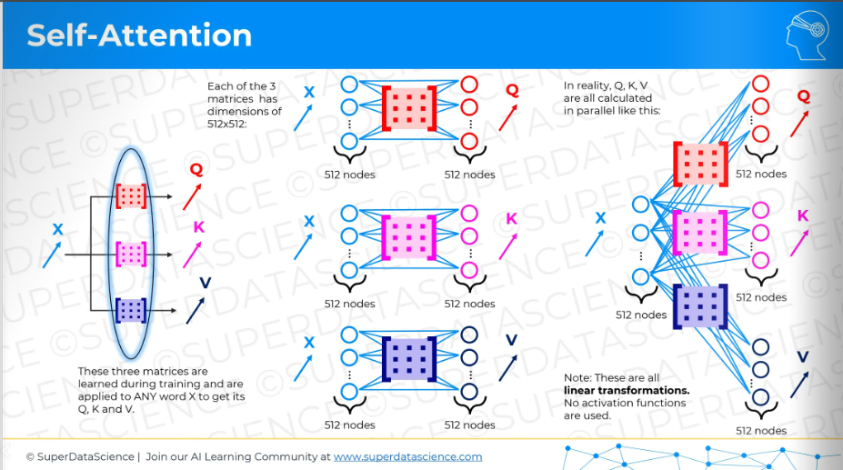

<small>Source: [https://online.fliphtml5.com/grdgl/qhfw/#p=72](https://online.fliphtml5.com/grdgl/qhfw/#p=72){target="_blank"}</small>

## Step 3: Adding Attention {.smaller}

Comparing a words `Q-Vector` (what it wants) with all other words `K-Vectors`, including its own, using the **Dot Product**. The results are processed via *SoftMax* for all words and are written in an *importance vector* (see the yellow framed vector). It shows the importance of each other word in the prompt for the analyzed word (`it`).

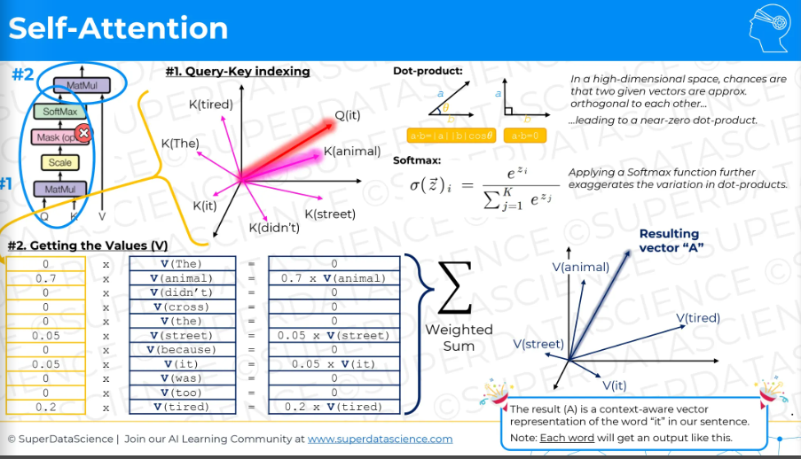

<small>Source: [https://online.fliphtml5.com/grdgl/qhfw/#p=73](https://online.fliphtml5.com/grdgl/qhfw/#p=73){target="Blank_"}</small>

## Step 3: Adding Attention {.smaller}

The final *Position* and *Attention-Aware* `Vector A` for the word of interest (`it`) is created as a weighted sum from all `V-Vectors` in the prompt.

The procedure described above is applied to all words in the prompt.


<small>Source: [https://online.fliphtml5.com/grdgl/qhfw/#p=73](https://online.fliphtml5.com/grdgl/qhfw/#p=73){target="Blank_"}</small>

## Step 4: Multi Head Processing {.smaller}

**Multi Head Processing:** When creating `Q`, `K` and `V` vectors, they are created with a smaller dimensionality. Here 8 vectors with dimension 64 each.

This allows *Self-Attention* to use different focus for each section.

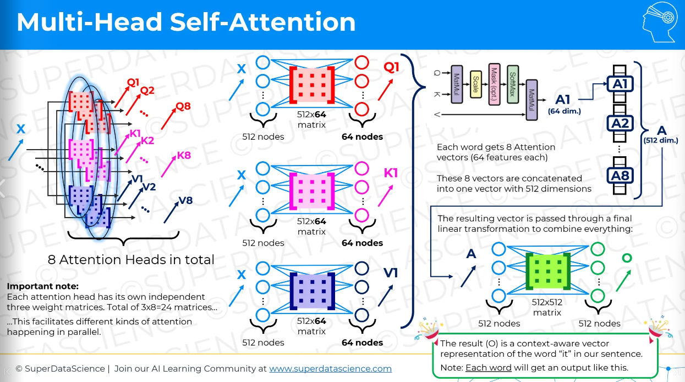

<small>Source: [https://online.fliphtml5.com/grdgl/qhfw/#p=75](https://online.fliphtml5.com/grdgl/qhfw/#p=75){target="_Blank"}</small>

## Step 4: Multi Head Processing (Visualization from Google)

[https://colab.research.google.com/github/tensorflow/tensor2tensor/blob/master/tensor2tensor/notebooks/hello_t2t.ipynb#scrollTo=OJKU36QAfqOC](https://colab.research.google.com/github/tensorflow/tensor2tensor/blob/master/tensor2tensor/notebooks/hello_t2t.ipynb#scrollTo=OJKU36QAfqOC){target="\"Blank_"}

## Steps 5a, 5b, 5c, 5d {.columns .smaller}

::: {.column width="60%"}
**Residual Connection:** Add information from previous steps (again) to the system. In case it got lost during training.

**Normalization** of *attention-aware* vector

**Feed Forward Neural Network (MLP)** to add non-linearity

**Multiple Layers with Self Attention** (96 in *GPT3*)
:::

::: {.column width="40%"}

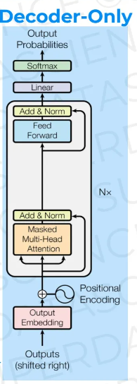 

<small>Source: [https://online.fliphtml5.com/grdgl/qhfw/#p=12](https://online.fliphtml5.com/grdgl/qhfw/#p=12){target="Blank_"}</small>

:::

## Step 6: Training {.smaller}

All words (*position* and *attention-aware vectors*) - `A-Vectors` - from the prompt are simultaneously moved through a non-linear model, and the next word for each word in the prompt is predicted.

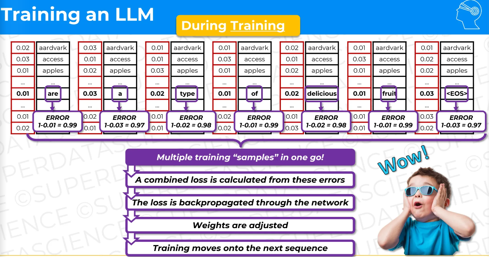

<small>Source: [https://online.fliphtml5.com/grdgl/qhfw/#p=130](https://online.fliphtml5.com/grdgl/qhfw/#p=130){target="_blank"}</small>

## Parallelization

Most tasks such as *Content-Awareness* and *Position Awareness* are processed for individual words/tokens. This means they can be assigned to different cores and computer clusters. Making training very fast as a result of **Parallelization**

Not only the next word of a prompt is predicted but also the next words for all other words in the prompts. That seems like a waste as we do know the words. It is a waste in the production state of the transformer, but in the training state (by masking each word's following word), the GPT can learn the next word for the complete *Context Window*. **A Transformer can learn 32,000 words in one run**.

## What we wanted from an LLM: We are here  {.smaller}


Source: [https://online.fliphtml5.com/grdgl/qhfw/#p=12](https://online.fliphtml5.com/grdgl/qhfw/#p=12){target="Blank_"}


## LLM (Fine) Tuning {.smaller}

After a model is trained with *language* (i.e., the complete Internet), it needs to be *fine-tuned* to perform specific tasks:

**Self-supervised:** Train on the desired data from the beginning (extremely expensive)

**Reinforcement Learning from Human Feedback (RLHF):**

1) Work with labeled data from humans
2) Create reward model
3) Adjust original model

**Supervised Learning**

## Supervised Learning {.smaller}

**Transfer Learning:** 

- Freeze all parameters except the last one or two layers (could also be different layers)
- retrain last  one or two layers with new data

**Parameter Efficient Fine Tuning (PEFT) Methods**

1) **Adapters:** Freeze parameters. Then add adapters to the model, and train the parameters of the *adapters* with the new data
2) **Low-Rank Adaptation:** Generate for each parameter matrix in the model, two matrices that when multiplied give the values of the matrix (*decomposing* $A$). E.g., $A$ has the dimension $512\times 512$ and $B$ has $512\times2$ and $C$ has $2\times512$. So that $B\cdot C=A$. Freeze $A$ and train $B$ and $C$ with new data (these are 2048 elements rather than 262144 elements). Multiply $B$ and $C$ and add it to $A$. This gives the *fine-tuned* weights.


3) **Prompt Tuning:** E.g. *RAGs*


## Where to Learn More About Transformers and LLM

**GenAI & LLMs A-Z (Advanced Technical Course)** <br> A Super Data Science course. The course is not free but a free trial of Super DataScience is available.

[https://community.superdatascience.com/c/llm-gpt](https://community.superdatascience.com/c/llm-gpt){target="blank_"}

## RAGs - Prompt Engineering in Combination with Search Engine

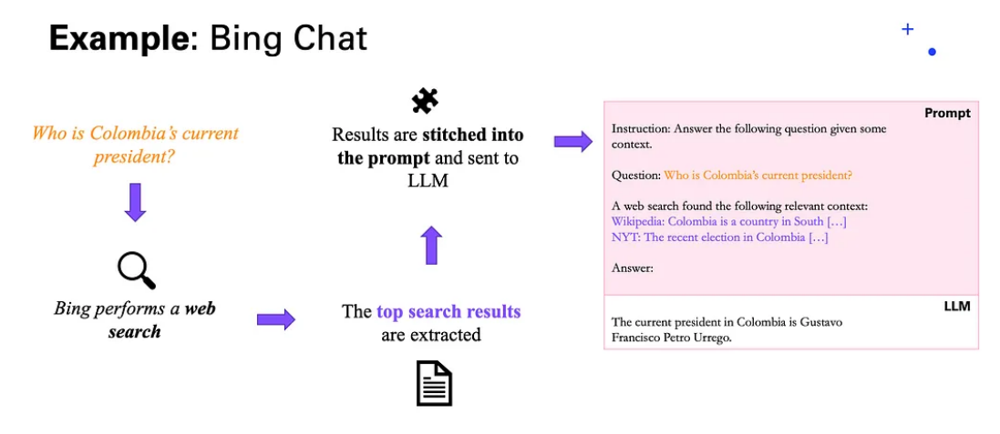

## Prompt Engineering (Example)


Use to *ChatGPT* Windows with these propmpts:

**1. Window**

1. "Tell me about Monserat"

**2. Window**

1. "Tell me about Times Roman"
2. "Tell me about Monserat"

## Prompt Engineering (Example: Gift Recommender)

[https://ai.centillionware.com/gift/](https://ai.centillionware.com/gift/){target="blank_"}

## Prompt Engineering (Example: Gift Recommender)

```         
$prompt = "
```

```         
    Find a birthday gift that cost between $budget_min dollars and $budget_max for a $sex person who is $age years old. 
```

```         
    The person's hobbies are $hobbies.
```

```         
    Sport is $sport_scale. $sport
```

```         
    Movies are $movie_genre_scale. $movie_genre
```

```         
    Books are $author_scale. $author
```

```         
    Food is $food_scale. $food
```

```         
  ";
```

## Demo 1: Prompt Engineering (Human Writer)

## Demo 2: AI Book in 
[ai.lange-analytics.com](ai.lange-analytics.com){target+"_blank"}

Also try in ChatGPT