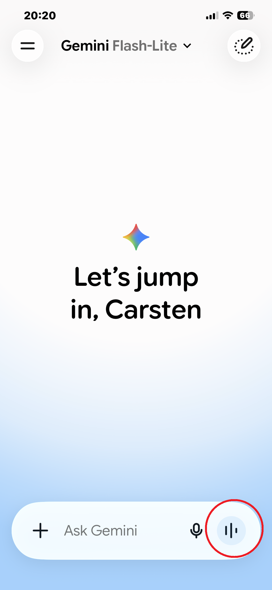

## Stylized Example: Time travel with a TV to the year 1885 {.smaller}

::: {.column width="40%"}
**Perception**

-   Excitement

-   Little artificial people inside the box are staging a play
:::

::: {.column width="58%"}
{fig-alt="A TV displaying a western"}
:::

## Stylized Example: Time travel with a TV to the year 1885 {.smaller}

::: {.column width="40%"}
**Dangers without Technology Background**

-   What if something gets out of the TV box

-   ~~People watch to much TV and do not socialize enough~~
:::

::: {.column width="50%"}
{fig-alt="A TV displaying a western with bullets flying out of it"}
:::

## Stylized Example: Time travel with a TV to the year 1885 {.smaller}

::: {.column width="42%"}
**Dangers with Technology Background**

TVs are just an arrangement of millions of colored pixels and our eye/brain processes them to a picture

-   ~~What if something gets out of the TV box~~

-  **Real Dangers**
  -  People watch to much TV and do not socialize enough
  -  Misinformation, etc.

- **Opportunities**
  - Entertainment
  - Mass education
  - YouTube educational videos
:::

::: {.column width="55%"}
{fig-alt="A TV displaying a western with bullets flying out of it"}
:::

##  Overview {.smaller}

**Problems:**

- Dealing with Cheating 
<br>

**Technology:**

- How *genAI* works
<br>

**Opportunities:**

-   Adding a *genAI* Assistant to your class (demo and "how to")
-   Teach me about . . . with Gemini
-   Flipped classroom with AI support
-   Break out: Learning with standalone *genAI* (teach me about ...)
-   Converting AI Prompts into Learning Outcome

**Discussion**


## Cheating in Homeworks and Quizzes

`Cheating is not new in academia, but the ease it can be done with genAI is new!`

**Examples:**

-   Write a paper about the civil war
-   [Cheating related to take-home and online quizzes](https://econ.lange-analytics.com/HomeworkQLive/HW6061/HW6061.html){target="_blank"} <br> (Google Lens is in "Hamburger Menu" -\> Search with Lens)

## Cheating in Homeworks and Quizzes {.smaller}

`We need to be creative! We need to fight technology with technology!`<br> `Restrictions are not helping!`<br><br>

**A few ideas:**<br>

**Small Grade Weights:** Assign small weights to take-home assignments and online quizzes

**Strict Administrative Policies for midterm and final proctoring:**

-   Phone drops etc.
-   `Screen monitoring` for online work in our labs
-   `Lock-Down` browser like 'Respondus'
-   `Proctoring Centers` for (a limited amount of) homeworks and online quizzes. Computers can be very basic.

# How Generative AI (GenAI) Works in 8 Minutes ..

## How Generative AI (GenAI) Works in 8 Minutes

### Coding Words with Meaning - Embedding

{width="230"}

```{=html}
<table border="1">
  <thead>
    <tr>
      <th></th>
      <th><strong>King</strong></th>
      <th><strong>Queen</strong></th>
    </tr>
  </thead>
  <tbody>
    <tr>
      <td><strong>Noun</strong></td>
      <td>---</td>
      <td>---</td>
    </tr>
    <tr>
      <td><strong>Female</strong></td>
      <td>---</td>
      <td>---</td>
    </tr>
    <tr>
      <td><strong>Royal</strong></td>
      <td>---</td>
      <td>---</td>
    </tr>
    <tr>
      <td><strong>---</strong></td>
      <td>---</td>
      <td>---</td>
    </tr>
  </tbody>
</table>
```

## How Generative AI (GenAI) Works in 8 Minutes

### Coding Words with Meaning - Embedding/Tokenization

{width="230"}

```{=html}
<table border="1">
  <thead>
    <tr>
      <th></th>
      <th><strong>King</strong></th>
      <th><strong>Queen</strong></th>
    </tr>
  </thead>
  <tbody>
    <tr>
      <td><strong>Noun</strong></td>
      <td>1</td>
      <td>1</td>
    </tr>
    <tr>
      <td><strong>Female</strong></td>
      <td>---</td>
      <td>---</td>
    </tr>
    <tr>
      <td><strong>Royal</strong></td>
      <td>---</td>
      <td>---</td>
    </tr>
    <tr>
      <td><strong>---</strong></td>
      <td>---</td>
      <td>---</td>
    </tr>
  </tbody>
</table>
```

## How Generative AI (GenAI) Works in 8 Minutes

### Coding Words with Meaning - Embedding

{width="230"}

```{=html}
<table border="1">
  <thead>
    <tr>
      <th></th>
      <th><strong>King</strong></th>
      <th><strong>Queen</strong></th>
    </tr>
  </thead>
  <tbody>
    <tr>
      <td><strong>Noun</strong></td>
      <td>1</td>
      <td>1</td>
    </tr>
    <tr>
      <td><strong>Female</strong></td>
      <td>0.1</td>
      <td>0.9</td>
    </tr>
    <tr>
      <td><strong>Royal</strong></td>
      <td>---</td>
      <td>---</td>
    </tr>
    <tr>
      <td><strong>---</strong></td>
      <td>---</td>
      <td>---</td>
    </tr>
  </tbody>
</table>
```

## How Generative AI (GenAI) Works in 8 Minutes

### Coding Words with Meaning - Embedding

{width="230"}

```{=html}
<table border="1">
  <thead>
    <tr>
      <th></th>
      <th><strong>King</strong></th>
      <th><strong>Queen</strong></th>
    </tr>
  </thead>
  <tbody>
    <tr>
      <td><strong>Noun</strong></td>
      <td>1</td>
      <td>1</td>
    </tr>
    <tr>
      <td><strong>Female</strong></td>
      <td>0.1</td>
      <td>0.9</td>
    </tr>
    <tr>
      <td><strong>Royal</strong></td>
      <td>0.9</td>
      <td>0.8</td>
    </tr>
    <tr>
      <td><strong>---</strong></td>
      <td>---</td>
      <td>---</td>
    </tr>
  </tbody>
</table>
```

## How Generative AI (GenAI) Works in 8 Minutes

### Coding Words with Meaning - Embedding with AI Categories

**Generating  tokens with Bag of Words method**

{width="230"}

```{=html}
<table border="1">
  <thead>
    <tr>
      <th></th>
      <th><strong>King</strong></th>
      <th><strong>Queen</strong></th>
    </tr>
  </thead>
  <tbody>
    <tr>
      <td><strong>Category #1</strong></td>
      <td>3876</td>
      <td>925</td>
    </tr>
    <tr>
      <td><strong>Category #2</strong></td>
      <td>7189</td>
      <td>2636</td>
    <tr>
      <td><strong>Category #3</strong></td>
      <td>232</td>
      <td>7652</td>
    </tr>
    <tr>
      <td><strong>. . .</strong></td>
      <td>. . .</td>
      <td>. . .</td>
    </tr>
    <tr>
      <td><strong>Category #1024</strong></td>
      <td>3423</td>
      <td>8567</td>
    </tr>
  </tbody>
</table>
```

## How Generative AI (GenAI) Works in 8 Minutes

### Ordering Words in a Prompt

**<span style="color:red;">Dog bit boy</span>**

vs.

**<span style="color:red;">Boy bit dog</span>**

- Gemini can process a prompt with a maximum of 2 million tokens (about 1.5 million word)
- Words/Tokens are processed successively through a neural network
- The position of a word coded in 1024 numbers is simply added to its token 

## How Generative AI (GenAI) Works in 8 Minutes

### Attention

**The <span style="color:red;">dog</span> did not cross the road because it was to <span style="color:red;">tired</span>**

**The dog did not cross the <span style="color:red;">road</span> because it was to <span style="color:red;">wide</span>**

<br>
Attention mechanism is mathematically complex, but at the end, <br>
a list of numbers that indicates which of the other words matters for attention <br>
is added to the token of each of the words.

## How Generative AI (GenAI) Works in 8 Minutes

### Guessing the next word

The word with the highest probability among all 30,00 words of the English language is added to the prompt.

Then the next word, the next, . . ., until *end of sentence* is reached.

## How Generative AI (GenAI) Works in 8 Minutes

### Fine Tuning

- Supervised learning
- Include extra information in the prompt
- delete some parameters and relearn with specialized data

# Using `genAI` to Support Teaching **

## Using `genAI` to Support Teaching {.smaller}

`Cheating Allowed:` Students prepare assignments at home with *genAI* and finalize them in a proctored environment in class without *genAI*

**Example:**

**Paper about Civil War**

**At home:**

- students prepare the papers with the use of *genAI* and they report about the process
- instructor reads papers before class but does not provide the feedback before the class session

<hr>

**In class:**

- students get feedback from instructor  
- students finish the paper without AI in a proctored environment

## Building a Course Assistant for Your Class {.smaller}

**Course Assistants**

[Click for an example (you need a Google account)](https://notebooklm.google.com/notebook/29e5ca47-19e1-4cbd-961a-129378412f2d/preview){target="_blank" style="color: lightblue !important; font-weight: bold;"}


1.**Access the Platform:** Requires a Google Account. Navigate to [**https://notebooklm.google.com**](https://notebooklm.google.com){target="blank_"} in your browser. If prompted, log in using your standard Google credentials.

2. **Create a New Notebook:** On the main dashboard, click the large card that says New Notebook (or the + icon). This opens up a completely fresh, empty workspace.

3. **Upload Your  PDFs:** Max 200 MB per file. An Add sources window will automatically pop up. Select Upload files (or drag and drop)

4. **Add Your Context Note:** Once the PDFs finish loading, click the + (Add source) button in the left panel again, select Note, and paste your routing instructions (telling it when to read Syllabus file versus the Textbook file).


## `genAI` Learning (Teach me about Mean and Median)

::::: columns
::: {.column width="33%"}
{width="222"}
:::

::: {.column width="67%"}
-   The following is based on a *Gemini Learning* conversation
-   To be visually more appealing two avatars were added with *genAI*.
    -   a cartoon character asking the questions
    -   a *wise man* (a *desert hermit brewer* from *HeyGen*)

**Note: The Gemini phone app was used entirely audio-based (2:30).**
:::
:::::

## `genAI` Learning (Teach me about Mean and Median)

{width="371"}

<audio controls data-autoplay src="1IntroQuestion.wav">

</audio>

## `genAI` Learning (teach me about Mean and Median)

{width="1111" controls="true" data-autoplay="true"}

## `genAI` Learning (Teach me about Mean and Median)

{width="371"}

<audio controls data-autoplay src="3PleaseStartMean.wav">

</audio>

## `genAI` Learning (teach me about Mean and Median)

{width="1111" controls="true" data-autoplay="true"}

## `genAI` Learning (Teach me about Mean and Median)

{width="371"}

<audio controls data-autoplay src="5StartMedian.wav">

</audio>

## `genAI` Learning (teach me about Mean and Median)

{width="1111" controls="true" data-autoplay="true"}

## `genAI` Learning (Teach me about Mean and Median)

{width="371"}

<audio controls data-autoplay src="7AskToRepaetMedian.wav">

</audio>

## `genAI` Learning (teach me about Mean and Median)

{width="1111" controls="true" data-autoplay="true"}

## `genAI` Learning (Teach me about Mean and Median)

{width="371"}

<audio controls data-autoplay src="9ConfirmMedian.wav">

</audio>

## `genAI` Learning (teach me about Mean and Median)

{width="1111" controls="true" data-autoplay="true"}

## `genAI` Learning 

<br> **genAI will not substitute instructors!**

**genAI will allow us to focus on higher skills, something we always wanted!**

## `genAI` Learning (Teach Me How to ...)

`Use Flipped Classroom (this is an old concept) where genAI, textbooks, and videos teach the basics and the instructor focusses on higher skills in the classroom`

-   fact and skills learning at home
    -   use *genAI*: please teach me about ... (example follows)
    -   students use textbooks or videos to verify what they learned from *Gemini*
-   higher skills and questions are covered in the classroom

## Experience Gemini Talk on your Phone ****{.smaller}

Example prompts (please find better ones):

- **Animation:** Teach me the very basics about how to make an animation film. Be short to keep it conversational.

- **Architecture:** Teach me about the difference between Gothic and Renaissance styles. Be short to keep it conversational.

- **Dance:** Teach me about ballet shoes . Be short to keep it conversational.

- **Film:** Teach me about the schema of romantic films. Be short to keep it conversational.

- **Music:** Teach me about major and minor scales and the 12 halftones. Be short to keep it conversational.

- **Theater:** Teach me about the main components of a stage. Be short to keep it conversational.

- **Visual Arts:** Teach me about the colors in painting. Be short to keep it conversational.

- **Writing:** Teach me about verbs in writing. Be short to keep it conversational.

**In your conversations use potentially:**

- I do not get this topis ...
- I like you to focus more on (theory, application for ..., etc)
- Be short because I cannot read while driving 
- No, I meant, . . .
- Can we talk on a more basic level. I am just a beginner


## Turning Learning Outcomes Into GenAI Learning Questions

[Example](https://learnguide.pythonanywhere.com/learnoutapp/makeguidev2/?SelectedCourseId=clange!cpp.edu!ec3322&Name=Carsten+Lange#RIntroAh){target="_blank"}

[Tool](GenerateChatGPTLink.html){target="_blank"}

[How the tool was programed](AIPromptLinkGeneratorWebpageGoogleGemini.pdf){target="_blank"}

## Thank You All

The slides are available at:

[https://ai.lange-analytics.com/short/csssa.html](https://ai.lange-analytics.com/short/csssa.html){target="_blank"}