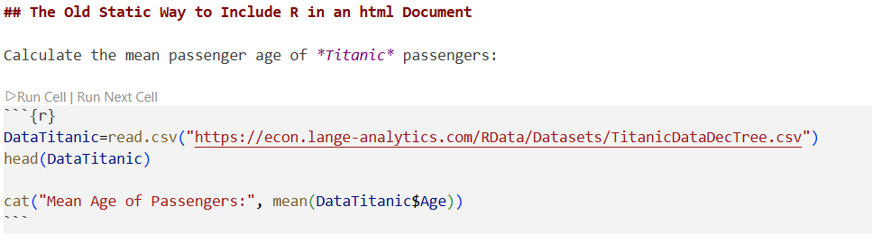
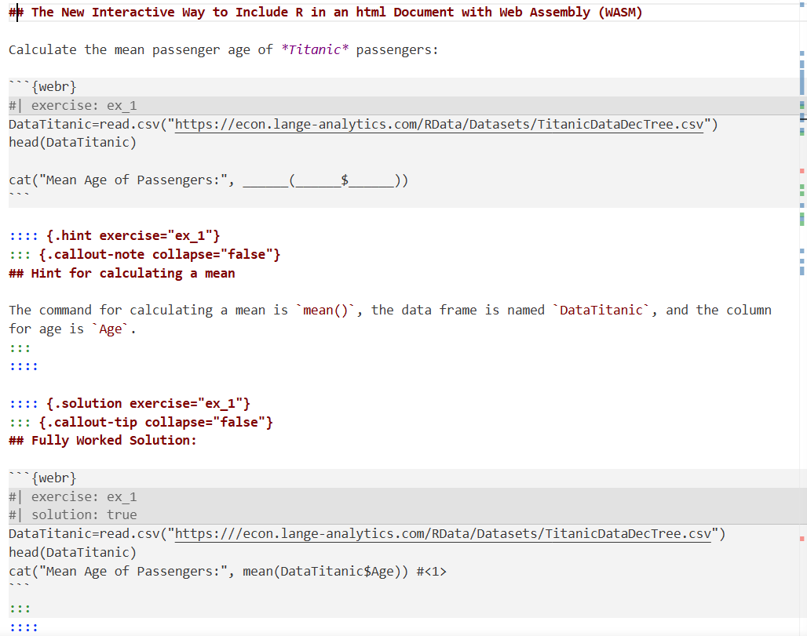
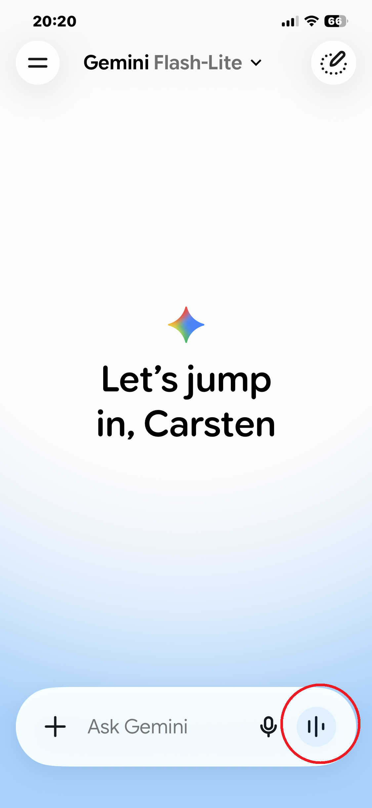
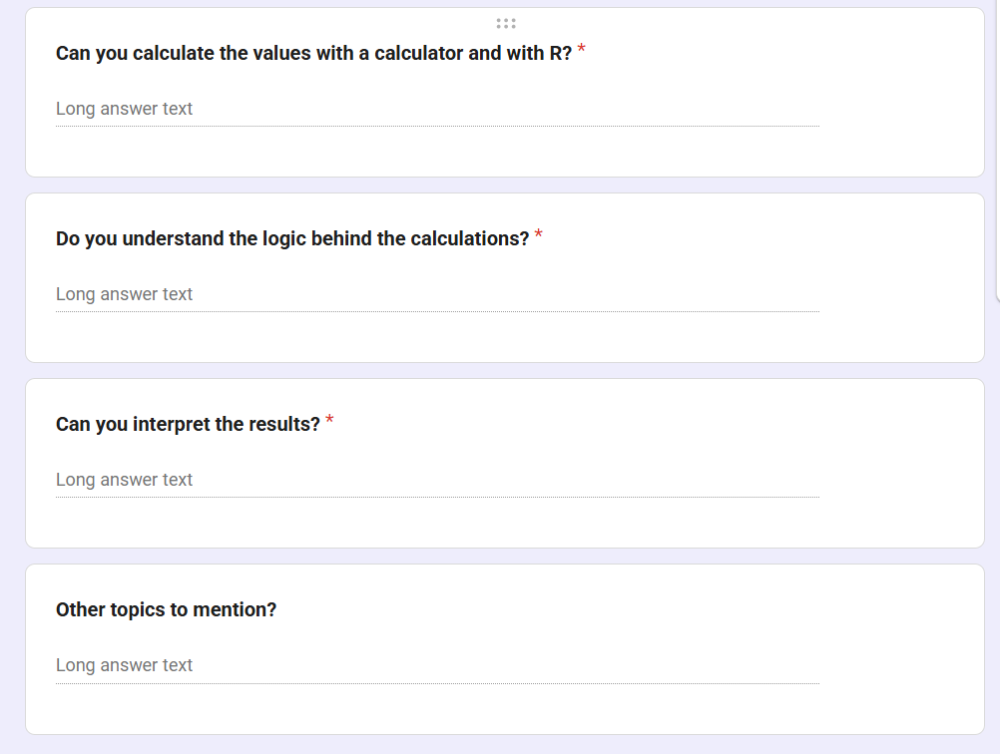





## Overview

1. **R and Python: Interactivity in a Browser Using Quarto from Posit**

    -   Slides with interactive *R* and *Python* code
    -   Tutorials with interactive *R* and *Python* code
    -   Quizzes with interactive *R* and *Python* code

2. **Demo: Virtual Reality for 3D Regressions**

3. **genAI use in Education**

    -   *genAI* interacts with students about Learning Outcome
    -   *genAI* assess course success
    -   *genAI* without hallucinations in a clearly defined environment (textbook and syllabus)

# 1) Running R and Python in a Browser

## Running R in a Browser

**R is a freely available Statistics Software**

Most commonly *R* is installed together with an IDE (i.e., advanced editor) on a faculty or student's PC

[Introduction to R and RStudio](https://ai.lange-analytics.com/htmlbook/RAndRStudio.html){target="_blank"}

## The Old Static Way to Include R in an html Document

Calculate the mean passenger age of *Titanic* passengers:

```{r}
DataTitanic=read.csv("https://econ.lange-analytics.com/RData/Datasets/TitanicDataDecTree.csv")
head(DataTitanic)

cat("Mean Age of Passengers:", mean(DataTitanic$Age))
```

## Quarto Code



## The New Interactive Way to Include R in an html Document with Web Assembly (WASM)

Calculate the mean passenger age of *Titanic* passengers:

```{webr}
#| exercise: ex_1
DataTitanic=read.csv("https://econ.lange-analytics.com/RData/Datasets/TitanicDataDecTree.csv")
head(DataTitanic)

cat("Mean Age of Passengers:", ______(______$______))
```

:::: {.hint exercise="ex_1"}
::: {.callout-note collapse="false"}
## Hint for calculating a mean

The command for calculating a mean is `mean()`, the data frame is named `DataTitanic`, and the column for age is `Age`.
:::
::::

:::: {.solution exercise="ex_1"}
::: {.callout-tip collapse="false"}
## Fully Worked Solution:

```{webr}
#| exercise: ex_1
#| solution: true
DataTitanic=read.csv("https:///econ.lange-analytics.com/RData/Datasets/TitanicDataDecTree.csv")
head(DataTitanic)
cat("Mean Age of Passengers:", mean(DataTitanic$Age)) #<1>
```

1.  the command `mean()` calculates the mean age from the column `DataTitanic$Age`
:::
::::

```{webr}
#| exercise: ex_1
#| check: true
gradethis::grade_this_code()
```


## Quarto Code



## Documentation: Interactive html files for R and Python

[Docs about WASM with *R* and *Python*](https://r-wasm.github.io/quarto-live/){target="blank_"}

## Creating R Quizzes

-   All students get the same question
-   Each student gets different numbers
-   Everything quiz runs in a browser
-   Quizzes are automatically graded

[Example Quiz](https://econ.lange-analytics.com/HomeworkQLive/auth/login.php?next=../HW9091/HW9091.html){target="blank_"}

# 2) Using VR to Explain Multivariate Regression {.smaller}

{fig-align="center" width="808"}

## Problems with Multivariate Regression

-   Simple Regression is 2-dimensional perfect for paper
-   Simplest Multivariate Regression is 3D
    -   Understanding 3 dimensions on a 2-dimensional paper or screen is challenging
    -   This leads to VR with 3 dimensions
 

## How the Diagram Exhibition App Works {.smaller}
 
-   Various Data are displayed

    -   Narrated by an instructor by the classroom session
    -   Narrated by an avatar in the self-learning edition

-   Data and Regression planes can be changed and adjusted

    -   New scenes (new data with or with or without regression planes are chosen by the self-learner or the instructor)
    -   New scenes (new data with or with or without regression planes are chosen by the instructor)

## Self-Learner VersionExplained in a (shortened) Video

- [Walkthrough Video I took when I used the app with a Meta Quest headset](VideoForSepOct26Presentation.mp4){target=_blank}

- [More VR Videos in my YouTube Channel](https://www.youtube.com/@PracticalMachineLearningWithR){target=_blank}

# 2) Using `genAI` to Support Teaching

## genAI Educational Innovation

-   books, videos, and even Google searches are one way learning tools:\
    Providing information but no conversations

-   genAI, when used correctly can support a real conversation like between a student and their tutor

## `genAI` Learning (Teach me about Mean and Median)

::::: columns
::: {.column width="33%"}
{width="222"}
:::

::: {.column width="67%"}
-   The following is based on a *Gemini Learning* conversation
-   To be visually more appealing two avatars were added with *genAI*.
    -   a cartoon character asking the questions
    -   a *wise man* (a *desert hermit brewer* from *HeyGen*)

**Note: The Gemini phone app was used entirely audio-based (2:30).**
:::
:::::

## `genAI` Learning (Teach me about Mean and Median)

{width="371"}

<audio controls data-autoplay src="1IntroQuestion.wav">

</audio>

## `genAI` Learning (teach me about Mean and Median)

{width="1111" controls="true" data-autoplay="true"}

## `genAI` Learning (Teach me about Mean and Median)

{width="371"}

<audio controls data-autoplay src="3PleaseStartMean.wav">

</audio>

## `genAI` Learning (teach me about Mean and Median)

{width="1111" controls="true" data-autoplay="true"}

## `genAI` Learning (Teach me about Mean and Median)

{width="371"}

<audio controls data-autoplay src="5StartMedian.wav">

</audio>

## `genAI` Learning (teach me about Mean and Median)

{width="1111" controls="true" data-autoplay="true"}

## `genAI` Learning (Teach me about Mean and Median)

{width="371"}

<audio controls data-autoplay src="7AskToRepaetMedian.wav">

</audio>

## `genAI` Learning (teach me about Mean and Median)

{width="1111" controls="true" data-autoplay="true"}

## `genAI` Learning (Teach me about Mean and Median)

{width="371"}

<audio controls data-autoplay src="9ConfirmMedian.wav">

</audio>

## `genAI` Learning (teach me about Mean and Median)

{width="1111" controls="true" data-autoplay="true"}

## `genAI` Learning

<br> **genAI will not substitute instructors!**

**genAI will allow us to focus on higher skills, something we always wanted!**

## `genAI` Learning (Teach Me How to ...)

`Use Flipped Classroom (this is an old concept) where genAI, textbooks, and videos teach the basics and the instructor focusses on higher skills in the classroom`

-   fact and skills learning at home
    -   use *genAI*: please teach me about ... (example follows)
    -   students use textbooks or videos to verify what they learned from *Gemini*
-   higher skills and questions are covered in the classroom

## Turning Learning Outcomes Into GenAI Learning Questions

1. [Example](https://learnguide.pythonanywhere.com/learnoutapp/makeguidev2/?SelectedCourseId=clange!cpp.edu!ec3322&Name=Carsten+Lange#DescriptiveIc){target="_blank"}

2. [Tool to generate link](GenerateChatGPTLink.html){target="_blank"}


## Evaluating Learning Outcomes: *Quartiles and Percentiles*

### Google Form for *Quartiles and Percentiles*

In class Google Forms is used to get student feedback for each learning outcome:



## Evaluating Learning Outcomes: *Quartiles and Percentiles* {.smaller}

### Question: Calculate Values

```{r}
#| echo: false
library(knitr)

# 1. Define your parameter
sheet_id <- "1ldmsWL7A78341Ht7w_XROnX6ESUo7vKWUC5t_UmD_to"

# 2. Build the CSV URL with a single %s placeholder
csv_url <- sprintf(
  "https://docs.google.com/spreadsheets/d/%s/export?format=csv",
  sheet_id
)

# 3. Read data
DataGoogleSheet <- read.csv(csv_url)
kable(DataGoogleSheet[,3])
```

## Evaluating Learning Outcomes: *Quartiles and Percentiles* {.smaller}

### Question: Understanding the Calculation

```{r}
#| echo: false
kable(DataGoogleSheet[,4])
```

## Evaluating Learning Outcomes: *Quartiles and Percentiles* {.smaller}

### Question: Interpreting the Results

```{r}
#| echo: false
kable(DataGoogleSheet[,5])
```

## Evaluating Learning Outcomes: *Quartiles and Percentiles* {.smaller}

### Question: Other Comments

```{r}
#| echo: false
kable(DataGoogleSheet[,6])
```

## Gemini Notebook

I created a *Gemini Notebook* and connected it to the Google Form (login: econcarsten@gmail.com)

Now I can ask questions about the evaluation.


## Building a Course Assistant for Your Class {.smaller}

**Course Assistants**

[Click for an example (you need a Google account)](https://notebook.google.com/notebook/29e5ca47-19e1-4cbd-961a-129378412f2d/preview){target="_blank" style="color: lightblue !important; font-weight: bold;"}

1.**Access the Platform:** Requires a Google Account. Navigate to [**https://notebooklm.google.com**](https://notebooklm.google.com){target="blank_"} in your browser. If prompted, log in using your standard Google credentials.

2.  **Create a New Notebook:** On the main dashboard, click the large card that says New Notebook (or the + icon). This opens up a completely fresh, empty workspace.

3.  **Upload Your PDFs:** Max 200 MB per file. An Add sources window will automatically pop up. Select Upload files (or drag and drop)

4.  **Add Your Context Note:** Once the PDFs finish loading, click the + (Add source) button in the left panel again, select Note, and paste your routing instructions (telling it when to read Syllabus file versus the Textbook file).

## Thank You All - Your Questions Please

The slides are available at: https://tinyurl.com/langehawkes2026