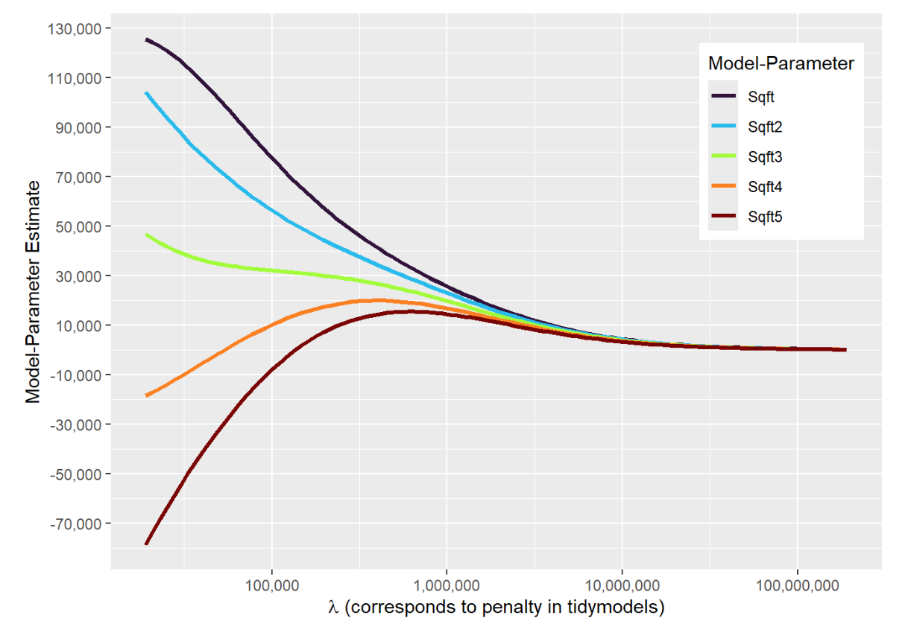
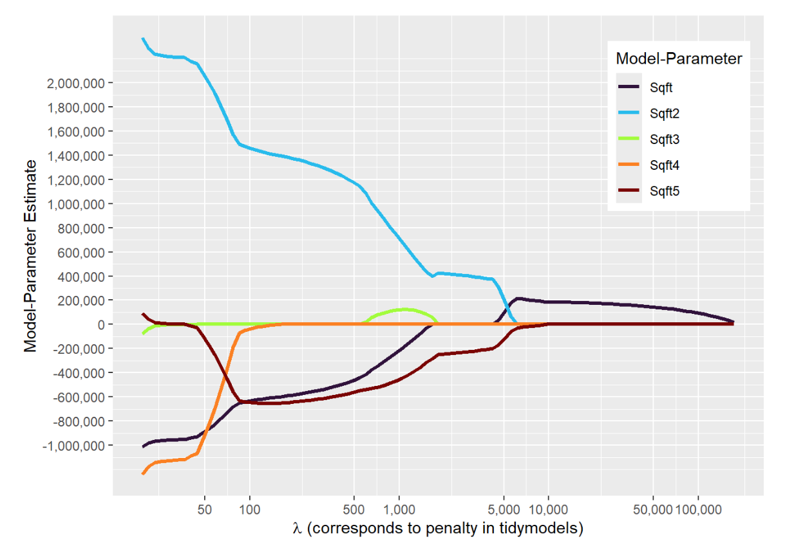




```{webr}
#| autorun: true
#| echo: false
DataHousing=
  read.csv("https://ai.lange-analytics.com/data/HousingData.csv") |>
  clean_names("upper_camel") |>
  select(Price, Sqft=SqftLiving)

set.seed(777)
Split001=initial_split(DataHousing, prop=0.001, strata=Price, breaks=5)
DataTrain=training(Split001)
DataTest=testing(Split001)

ModelDesignBenchmark=linear_reg() |>
                     set_engine("lm") |> 
                     set_mode("regression")

RecipeHouses=recipe(Price~., data=DataTrain) |> 
             step_mutate(Sqft2=Sqft^2,Sqft3=Sqft^3,
                         Sqft4=Sqft^4,Sqft5=Sqft^5) |> 
             step_normalize(all_predictors())

WFModelBenchmark=workflow() |> 
                 add_model(ModelDesignBenchmark) |> 
                 add_recipe(RecipeHouses) |> 
                 fit(DataTrain)

ModelDesignRidge=linear_reg(penalty=1000000, mixture=0) |> # 0 for Ridge, 1 for Lasso
                 set_engine("glmnet") |> 
                 set_mode("regression")

WFModelRidge=workflow() |> 
             add_model(ModelDesignRidge) |> 
             add_recipe(RecipeHouses) |> 
             fit(DataTrain)

ModelDesignLasso=linear_reg(penalty=500, mixture=1) |> # 0 for Ridge, 1 for Lasso
                 set_engine("glmnet") |> 
                 set_mode("regression")

WFModelLasso=workflow() |> 
             add_model(ModelDesignLasso) |> 
             add_recipe(RecipeHouses) |> 
             fit(DataTrain)
```


## What Will You Learn/Review {.scrollable .smaller}

-   The **basic idea behind regularization**

-   The difference between the **penalty terms for Lasso and Ridge** regression models

-   How the **target function for Lasso** regularized regression models differs from the $MSE$ function of an unregularized model

-   How to create a **workflow for a Lasso** regularized regression using the *R* `tidymodels` framework

-   How the **target function for Ridge** regularized regression model differs from the $MSE$ function of an unregularized model

-   How to create a **workflow for a Ridge** regularized model using the *R* `tidymodels` framework

## Packages ALready Installed in the Background

-   `tidyverse`
-   `tidymodels`
-   `glmnet`

## Loading Data, and Splitting in Training/Testing Data:

We again, use a training dataset with only **20 observation**. This will originally **cause overfitting**.<br><br>

```{webr}
DataHousing=
  read.csv("https://ai.lange-analytics.com/data/HousingData.csv") |>
  clean_names("upper_camel") |>
  select(Price, Sqft=SqftLiving)

set.seed(777)
Split001=initial_split(DataHousing, prop=0.001, strata=Price, breaks=5)
DataTrain=training(Split001)
DataTest=testing(Split001)
print(Split001)
```

<br>Later, we will use **regularization** to **mitigate the *overfitting* problem**.

## The Model {.smaller}


\begin{equation}
\displaystyle\widehat{Price}_i=\beta_1 Sqft_i+\beta_2 Sqft_i^2+\beta_3 Sqft_i^3+\beta_4 Sqft_i^4+\beta_5 Sqft_i^5+\beta_6 
\end{equation}

## Benchmark: Unregularized Model

### Only Minimizes the MSE by Choosing the Optimal $\beta s$ {.smaller}

$$
\displaystyle MSE=\frac{1}{20}\sum_{i=1}^{20} \left ( \widehat{Price}_i-Price_i\right)^2 
$$ with:

\begin{equation}
\displaystyle\widehat{Price}_i=\beta_1 Sqft_i+\beta_2 Sqft_i^2+\beta_3 Sqft_i^3+\beta_4 Sqft_i^4+\beta_5 Sqft_i^5+\beta_6 
\end{equation}

## Running the Unregularized Benchmark Model

```{webr}
ModelDesignBenchmark=linear_reg() |>
                     set_engine("lm") |> 
                     set_mode("regression")

RecipeHouses=recipe(Price~., data=DataTrain) |> 
                    step_mutate(Sqft2=Sqft^2,Sqft3=Sqft^3,
                                Sqft4=Sqft^4,Sqft5=Sqft^5) |> 
                    step_normalize(all_predictors())

WFModelBenchmark=workflow() |> 
                 add_model(ModelDesignBenchmark) |> 
                 add_recipe(RecipeHouses) |> 
                 fit(DataTrain)
tidy(extract_fit_engine(WFModelBenchmark)) # prints the betas in a tidy format
```

## Benchmark: Assessing Prediction Quality

**Training Data:**

```{webr}
DataTrainWithPredBenchmark=augment(WFModelBenchmark, DataTrain)
metrics(DataTrainWithPredBenchmark, truth=Price, estimate=.pred)
```

**Testing Data:**

```{webr}
DataTestWithPredBenchmark=augment(WFModelBenchmark, DataTest)
metrics(DataTestWithPredBenchmark, truth=Price, estimate=.pred)
```

## Regularization {.smaller}

### Ridge

\begin{eqnarray}
T^{arget}&=&\frac{1}{20}\sum_{i=1}^{20} \left ( \widehat{Price}_i-Price_i\right)^2+\lambda P^{enalty} \\
\mbox{with:}&& \widehat{Price}_i=\beta_1 Sqft_i+\beta_2 Sqft_i^2+\beta_3 Sqft_i^3+\beta_4 Sqft_i^4+\beta_5 Sqft_i^5+\beta_6 \nonumber \\
\mbox{with:}&& P^{enalty}=\sum_{j=1}^{5} \beta_j^2 \nonumber
\end{eqnarray}

**Two Goals:** Minimize $MSE$ and Minimize Penalty (small or zero $\beta s$)<br><br>

$T^{arget}$ value still only depends on data anf $\beta$'s!<br><br>

**Note,** when reducing a large and a small parameter by the same amount, the impact of reducing the large parameter has a bigger impact on the *penalty* than reducing the small parameter. Thus **Ridge has a tendency to reduce large rather than small parameters**.

## Running the Ridge Model

```{webr}
set.seed(777)
ModelDesignRidge=linear_reg(penalty=1000000, mixture=0) |>  # 0 for Ridge, 1 for Lasso
                 set_engine("glmnet") |> 
                 set_engine("glmnet") |> 
                 set_mode("regression")

WFModelRidge=workflow() |> 
             add_model(ModelDesignRidge) |> 
             add_recipe(RecipeHouses) |> 
             fit(DataTrain)

tidy(extract_fit_parsnip(WFModelRidge)) # prints the final betas in a tidy format
```

## Comparing the Coefficients ($\beta$'s')

::::: columns
::: {.column width="50%"}
**Benchmark Model Coefficients (**$\beta$'s):

```{webr}
tidy(extract_fit_engine(WFModelBenchmark)) # prints the betas in a tidy format
```
:::

::: {.column width="50%"}
**Ridge Model Coefficients (**$\beta$'s):

```{webr}
tidy(extract_fit_parsnip(WFModelRidge)) # prints the final betas in a tidy format
```
:::
:::::

## Comparing Prediction Quality Benchmark & Ridge Model (Training Data)

::::: columns
::: {.column width="50%"}
**Benchmark:**

```{webr}
DataTrainWithPredBenchmark=augment(WFModelBenchmark, DataTrain)
metrics(DataTrainWithPredBenchmark, truth=Price, estimate=.pred)
```
:::

::: {.column width="50%"}
**Ridge:**

```{webr}
DataTrainWithPredRidge=augment(WFModelRidge, DataTrain)
metrics(DataTrainWithPredRidge, truth=Price, estimate=.pred)
```
:::
:::::

## Comparing Prediction Quality Benchmark & Ridge Model (Testing Data)

::::: columns
::: {.column width="50%"}
**Benchmark:**

```{webr}
DataTestWithPredBenchmark=augment(WFModelBenchmark, DataTest)
metrics(DataTestWithPredBenchmark, truth=Price, estimate=.pred)
```
:::

::: {.column width="50%"}
**Ridge:**

```{webr}
DataTestWithPredRidge=augment(WFModelRidge, DataTest)
metrics(DataTestWithPredRidge, truth=Price, estimate=.pred)
```
:::
:::::

## Regularization {.smaller}

### Lasso

\begin{eqnarray}
T^{arget}&=&\frac{1}{20}\sum_{i=1}^{20} \left ( \widehat{Price}_i-Price_i\right)^2+\lambda P^{enalty} \\
\mbox{with:}&& \widehat{Price}_i=\beta_1 Sqft_i+\beta_2 Sqft_i^2+\beta_3 Sqft_i^3+\beta_4 Sqft_i^4+\beta_5 Sqft_i^5+\beta_6 \nonumber \\
\mbox{with:}&& P^{enalty}=\sum_{j=1}^{5} | \beta_j | \nonumber
\end{eqnarray}

**Two Goals:** Minimize $MSE$ and Minimize Penalty (small or zero $\beta s$)<br><br>

$T^{arget}$ value still only depends on data anf $\beta$'s!<br><br>

**Note,** reducing a large or a small $\beta$ parameter by the same amount has the same impact on the *penalty*. Thus Lasso would always reduce the parameter where the reduction has the smallest impact on the $MSE$. **Some parameters might be reduced to zero.**

## Running the Lasso Model

```{webr}
set.seed(777)
ModelDesignLasso=linear_reg(penalty=500, mixture=1) |>  # 0 for Ridge, 1 for Lasso
                 set_engine("glmnet") |> 
                 set_engine("glmnet") |> 
                 set_mode("regression")

WFModelLasso=workflow() |> 
             add_model(ModelDesignLasso) |> 
             add_recipe(RecipeHouses) |> 
             fit(DataTrain)

tidy(extract_fit_parsnip(WFModelLasso)) # prints the final betas in a tidy format
```

## Comparing the Coefficients ($\beta$'s')

::::: columns
::: {.column width="50%"}
**Benchmark Model Coefficients (**$\beta$'s):

```{webr}
tidy(extract_fit_engine(WFModelBenchmark)) # prints the betas in a tidy format
```
:::

::: {.column width="50%"}
**Lasso Model Coefficients (**$\beta$'s):

```{webr}
tidy(extract_fit_parsnip(WFModelLasso)) # prints the final betas in a tidy format
```
:::
:::::

## Comparing Prediction Quality Benchmark & Lasso Model (Training Data)

::::: columns
::: {.column width="50%"}
**Benchmark:**

```{webr}
DataTrainWithPredBenchmark=augment(WFModelBenchmark, DataTrain)
metrics(DataTrainWithPredBenchmark, truth=Price, estimate=.pred)
```
:::

::: {.column width="50%"}
**Lasso:**

```{webr}
DataTrainWithPredLasso=augment(WFModelLasso, DataTrain)
metrics(DataTrainWithPredLasso, truth=Price, estimate=.pred)
```
:::
:::::

## Comparing Prediction Quality Benchmark & Lasso Model (Testing Data)

::::: columns
::: {.column width="50%"}
**Benchmark:**

```{webr}
DataTestWithPredBenchmark=augment(WFModelBenchmark, DataTest)
metrics(DataTestWithPredBenchmark, truth=Price, estimate=.pred)
```
:::

::: {.column width="50%"}
**Lasso:**

```{webr}
DataTestWithPredLasso=augment(WFModelLasso, DataTest)
metrics(DataTestWithPredLasso, truth=Price, estimate=.pred)
```
:::
:::::

## Comparing Parameter Reduction For Different Penalties

::::: columns
::: {.column width="50%"}
**Ridge:**


:::

::: {.column width="50%"}
**Lasso:**


:::
:::::