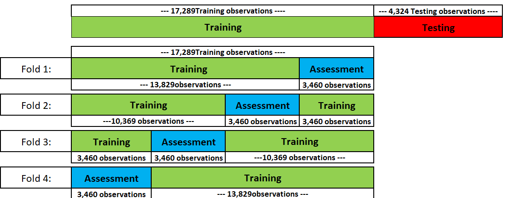
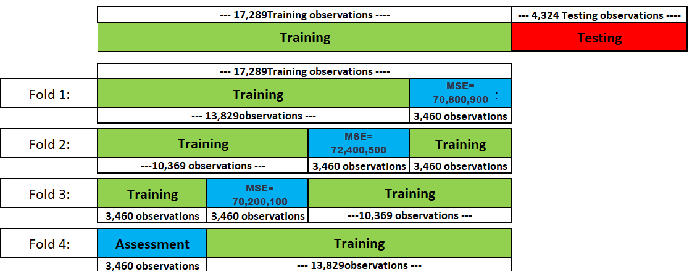
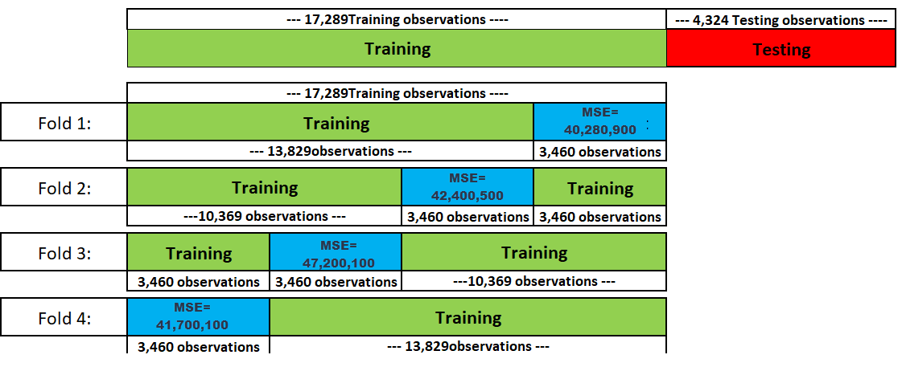




## Overview

You will learn about:


-   Overfitting in detail.

-   Circumstances that make *overfitting* more likely to occur.

-   Consequences of overfitting when predicting new data.

-   Hyper-parameter tuning to avoid *overfitting*.

    -   Validation
    -   Cross Validation


## Overfitting
<br><br><br>

> **Overfitting** occurs when a model performs well approximating the 
> *training data* but does not perform well when it faces new data to 
> predict outcomes (e.g., *testing data*).

*Overfitting* is one of the most pressing and still not fully solved problems in machine learning.

## Circumstances that Can Lead to Overfitting

<br><br>

::: {.incremental}
-   If the training dataset does **not have a sufficient number of observations**.

-   If the model considers **many variables** and thus contains **many parameters** to calibrate.

-   If the underlying machine learning model is **highly non-linear** leading to a highly flexible prediction function.
:::


## Libraries and Data  {.smaller}

**Libraries Loaded:**

```{r}
#| echo: true
library(tidymodels)
library(rio)
library(janitor)
```

**King County Real Estate Dataset:**

```{r}
#| echo: true
DataHousing = import("https://ai.lange-analytics.com/data/HousingData.csv") |>
              clean_names("upper_camel") |>
              select(Price, Sqft = SqftLiving)
head(DataHousing)
```

```{r}
#| echo: false
DataHousing = DataHousing |> 
              mutate(Sqft2=Sqft^2,Sqft3=Sqft^3,Sqft4=Sqft^4,Sqft5=Sqft^5)
set.seed(777)

Split001=initial_split(prop=0.001, strata=Price, 
                       breaks=5, data=DataHousing)

DataTrain = training(Split001)
DataTest = testing(Split001)

RecipeOLS=recipe(Price~Sqft, data=DataTrain)

ModelDesignOLS= linear_reg() |> 
  set_engine("lm") |> 
  set_mode("regression")

WFModelOLS= workflow() |>  
            add_recipe(RecipeOLS) |> 
            add_model(ModelDesignOLS) |> 
            fit(DataTrain)

RecipePoly5=recipe(Price~Sqft+Sqft2+Sqft3+Sqft4+Sqft5, data=DataTrain)

ModelDesignPoly5= linear_reg() |> 
                  set_engine("lm") |> 
                  set_mode("regression")

WFModelPoly5= workflow() |>  
            add_recipe(RecipePoly5) |> 
            add_model(ModelDesignPoly5) |> 
            fit(DataTrain)

DataTrainWithPredPoly5=augment(WFModelPoly5, DataTrain)

DataTestWithPredPoly5=augment(WFModelPoly5, DataTest)

# Degree 10 Polynom for ggplot
DataTrainPoly10=select(DataTrain, Price, Sqft) 
DataTestPoly10=select(DataTest, Price, Sqft) 
RecipePoly10=recipe(Price ~ ., data=DataTrainPoly10) |> 
  step_poly(Sqft, degree = 10, options = list(raw = TRUE)) 
  
  
WFModelPoly10=workflow() |> 
  add_model(ModelDesignPoly5) |>   #Poly5 is correct all ModelDesigns are the same      
  add_recipe(RecipePoly10) |> 
  fit(DataTrainPoly10)

DataTrainWithPredPoly10=augment(WFModelPoly10, DataTrainPoly10)
DataTestWithPredPoly10=augment(WFModelPoly10, DataTestPoly10)

```

```{webr}
#| autorun: true
#| echo: false
DataHousing = read.csv("https://ai.lange-analytics.com/data/HousingData.csv") |>
              clean_names("upper_camel") |>
              select(Price, Sqft = SqftLiving) |> 
              mutate(Sqft2=Sqft^2,Sqft3=Sqft^3,Sqft4=Sqft^4,Sqft5=Sqft^5)

set.seed(777)

Split001=initial_split(prop=0.001, strata=Price, 
                       breaks=5, data=DataHousing)

DataTrain = training(Split001)
DataTest = testing(Split001)

RecipeOLS=recipe(Price~Sqft, data=DataTrain)

ModelDesignOLS= linear_reg() |> 
  set_engine("lm") |> 
  set_mode("regression")

WFModelOLS= workflow() |>  
            add_recipe(RecipeOLS) |> 
            add_model(ModelDesignOLS) |> 
            fit(DataTrain)

RecipePoly5=recipe(Price~Sqft+Sqft2+Sqft3+Sqft4+Sqft5, data=DataTrain)

ModelDesignPoly5= linear_reg() |> 
                  set_engine("lm") |> 
                  set_mode("regression")

WFModelPoly5= workflow() |>  
            add_recipe(RecipePoly5) |> 
            add_model(ModelDesignPoly5) |> 
            fit(DataTrain)
```

## Data Visualization

There seems to be a non-linear trend:

```{r}
ggplot(aes(y=Price, x=Sqft), data=DataHousing)+
  geom_point(size=0.5)+
  geom_smooth(se=FALSE)
```

## Creating Overfitting Environment 


We want to **demonstrate overfitting**. Therefore, we create conditions that likely **trigger overfitting:** <br><br>

::: {.incremental}
- Very small training dataset with **20 observations** (equivalent to **0.1% of total observations**). The remaining 21,593 observations become *testing data*. <br><br>

- **Highly non-linear** machine learning model: **Degree-5 Polynomial Regression Model**
:::


## Creating Training and Testing Data

```{webr}
set.seed(777)

Split001=initial_split(prop=0.001, strata=Price, 
                       breaks=5, data=DataHousing)

DataTrain = training(Split001)
DataTest = testing(Split001)
Split001
```

## Polynomial Regressions


**Polynomial Univariate Prediction Equation (Degree 1):**
$$
\widehat{Price}=\beta_1 Sqft+\beta_2
$$

. . .

**Polynomial Univariate Prediction Equation (Degree 5):**

$$
\widehat{Price}=\beta_1 Sqft+\beta_2 Sqft^2+\beta_3 Sqft^3
   +\beta_4 Sqft^4+\beta_5 Sqft^5+\beta_6
$$

## Simple Regression

Polynomial Univariate Prediction Equation (Degree 1): 
$$
\widehat{Price}=\beta_1 Sqft+\beta_2
$$

```{webr}
RecipeOLS=recipe(Price~Sqft, data=DataTrain)

ModelDesignOLS= linear_reg() |> 
  set_engine("lm") |> 
  set_mode("regression")

WFModelOLS= workflow() |>  
            add_recipe(RecipeOLS) |> 
            add_model(ModelDesignOLS) |> 
            fit(DataTrain)
print(WFModelOLS)
```


## Fitted Univariate OLS Model

```{webr}
#| autorun: true
print(WFModelOLS)
```

$$
\widehat{Price}=`r round(tidy(extract_fit_engine(WFModelOLS))[[2,2]])` \cdot Sqft+`r format(round(tidy(extract_fit_engine(WFModelOLS))[[1,2]]), scientific = FALSE)`
$$

## Polynomial Regression {.smaller}

Polynomial univariate prediction equation (degree 5):

$$
\widehat{Price}=\beta_1 Sqft+\beta_2 Sqft^2+\beta_3 Sqft^3
   +\beta_4 Sqft^4+\beta_5 Sqft^5+\beta_6
$$

We create $Sqft^2$, $Sqft^3$, $Sqft^4$, and $Sqft^5$ as new variables in the data and treat them as they were separate variables in a multivariate regression.

```{webr}
DataHousing= DataHousing |> 
             mutate(Sqft2=Sqft^2,Sqft3=Sqft^3,Sqft4=Sqft^4,Sqft5=Sqft^5)
head(DataHousing)
```


This makes the regression **linear in variables** but **non-linear in data**.

Consequently, we can use OLS to find the optimal $\beta s$.

## Polynomial Regression Model

Degree-5 Polynomial Regression equation: 
$$
\widehat{Price}=\beta_1 Sqft+\beta_2 Sqft^2+\beta_3 Sqft^3+
                \beta_4 Sqft^4+\beta_5 Sqft^5+\beta_6
$$

```{webr}
RecipePoly5=recipe(Price~Sqft+Sqft2+Sqft3+Sqft4+Sqft5, data=DataTrain)

ModelDesignPoly5= linear_reg() |> 
                  set_engine("lm") |> 
                  set_mode("regression")

WFModelPoly5=workflow() |>  
             add_recipe(RecipePoly5) |> 
             add_model(ModelDesignPoly5) |> 
             fit(DataTrain)
print(WFModelPoly5)
```


## Fitted Polynomial Model (Degree 5) {.smaller}

```{webr}
#| autorun: true
print(WFModelPoly5)
```

$$
\begin{align}
\widehat{Price}=&
  `r format(round(tidy(extract_fit_engine(WFModelPoly5))[[2,2]]), scientific = FALSE)`
  \cdot Sqft +
    (`r format(round(tidy(extract_fit_engine(WFModelPoly5))[[3,2]]), scientific = FALSE)`)
  \cdot Sqft^2 +
    `r format(round(tidy(extract_fit_engine(WFModelPoly5))[[4,2]],4), scientific = FALSE)`
  \cdot Sqft^3 + \\
   & (`r format(round(tidy(extract_fit_engine(WFModelPoly5))[[5,2]],7), scientific = FALSE)`)
  \cdot Sqft^4 +
    `r format(round(tidy(extract_fit_engine(WFModelPoly5))[[6,2]],12), scientific = FALSE)`
  \cdot Sqft^5 +
  (`r format(round(tidy(extract_fit_engine(WFModelPoly5))[[1,2]]), scientific = FALSE)`)
\end{align}
$$


## Comparing Predictive Quality Based on Training Data

**Regular OLS:**

```{webr}
DataTrainWithPredOLS=augment(WFModelOLS, DataTrain)
metrics(DataTrainWithPredOLS, truth=Price, estimate=.pred)
```

**Polynomial Regression (Degree=5)**

```{webr}
DataTrainWithPredPoly5=augment(WFModelPoly5, DataTrain)
metrics(DataTrainWithPredPoly5, truth=Price, estimate=.pred)
```

Code to compare is linked in the footer of this slide.

::: {.footer}
See: [TrainTestScript.R Script100](https://econ.lange-analytics.com/RScripts/TrainTestScript.R)
:::

## Comparing Predictive Quality Based on Testing Data

**Regular OLS:**

```{webr}
DataTestWithPredOLS=augment(WFModelOLS, DataTest)
metrics(DataTestWithPredOLS, truth=Price, estimate=.pred)
```

**Polynomial Regression (Degree=5)**

```{webr}
DataTestWithPredPoly5=augment(WFModelPoly5, DataTest)
metrics(DataTestWithPredPoly5, truth=Price, estimate=.pred)
```

Code to compare is linked in the footer of this slide.

::: {.footer}
See: [TrainTestScript.R Script100](https://econ.lange-analytics.com/RScripts/TrainTestScript.R)
:::

## Polynomial Regression (degree=5) vs. Regular OLS

### Aproximation of the Training Data

```{r}
ggplot(aes(x=Sqft,y=Price), data=DataTrainWithPredPoly5)+
  geom_smooth(method = "lm", se=FALSE, size=1)+
  geom_point(color="red", size=2.3)+
  geom_line(aes(y=.pred), color="magenta", size=1, data=DataTestWithPredPoly5)+
  xlim(c(500,4500))+
  ylim(c(0,1500000))
```

## Polynomial Regression (degree=5) vs. Regular OLS {.smaller}

### Training and Testing Data Performance

```{r}
ggplot(aes(x=Sqft,y=Price), data=DataTestWithPredPoly5)+
  geom_point(size=0.001)+
  geom_smooth(method = "lm", se=FALSE, size=1, data=DataTrainWithPredPoly5)+
  geom_line(aes(y=.pred), color="magenta", size=1)+
  geom_point(color="red", size=2.3, data=DataTrainWithPredPoly5)+
  xlim(c(0,4500))+
  ylim(c(0,1500000))
```

$$\widehat{Price}=\beta_1 Sqft+\beta_2 Sqft^2+\beta_3 Sqft^3 + +\beta_4 Sqft^4 +\beta_5 Sqft^5 +\beta_{6}$$

## Polynomial Regression (degree=10) vs. Regular OLS {.smaller}

### Training and Testing Data Performance

```{r}
ggplot(aes(x=Sqft,y=Price), data=DataTestWithPredPoly10)+
  geom_point(size=0.001)+
  geom_smooth(method = "lm", se=FALSE, size=1, data=DataTrainWithPredPoly10)+
  geom_line(aes(y=.pred), color="magenta", size=1.2)+
  geom_point(color="red", size=2.3, data=DataTrainWithPredPoly10)+
  xlim(c(0,4300))+
  ylim(c(-150000,2000000))
```

$$\widehat{Price}=\beta_1 Sqft+\beta_2 Sqft^2+\beta_3 Sqft^3 +  \cdots +\beta_{10} Sqft^{10}+\beta_{11}$$

## SUMMARY: POLYNOMIAL REGRESSION and Overfitting

::: {.incremental}
-   If we do not have enough data *Polynomial Regression* with a high degree might lead to *overfitting*<br><br>

-   What is the right degree?<br><br>

-   We could try different degrees (e.g., 2, 3, 4, ... 10) and see which model performs best.<br><br>

-   Which data are we using to measure performance? 
    - Training data? -> overfitting problem
    - Testing data? -> cannot be used for model optimization
    - Training and Testing Data are out!<br><br>

-   We could split off data from the training dataset (**validation data**). These *validation data* are not used to calculate the βs. Instead, they are used to find the best setting for the degree of polynomial regression (aka hyper-parameter of polynomial regression).
:::

## Hyper-Parameters

-   Hyper-Parameters are parameters other than the $\beta$ parameters, because they can not be optimized by the optimizer.

-   Hyper-Parameters are like settings for a machine learning model such as the number of polynomials (e.g., $Sqft^N$) to be considered for polynomial regression. Another example are the number of $k$ Nearest Neighbors.

-   Hyper parameters often make a model more or less complex and thus influence the quality of predicting but also the chance of overfitting.

## PROBLEMS OF SPLITTING VALIDATION DATA OFF THE TRAINING DATA


-   Reduces data left over to train (finding optimal βs).

-   If the training dataset is big enough this is no problem. Otherwise, it is a problem!


## CROSS VALIDATION (4-FOLD)

For each hyper-parameter setting:

1.  Splits off validation data from training data (e.g. last quarter)

2.  Runs the model and calculates metrics based on validation data.

3.  Splits off validation data from training data (next quarter)

4.  Repeats steps 2 -- 3 four times.

. . .

We end up with four results for each hyper-parameter setting. We calculate the average of the four results as an result for that specific hyper parameter.

# Mock-up CROSS VALIDATION {.smaller}

What follows is a mock-up *Cross-Validation* for the *King County* real estate dataset.

We try out three hyper-parameter values for the degree of the polynomial regression. 

**degree 2:**

$$\widehat{Price}=\beta_1 Sqft+\beta_2 Sqft^2+\beta_3$$

**degree 3:**

$$\widehat{Price}=\beta_1 Sqft+\beta_2 Sqft^2+\beta_3 Sqft^3 + +\beta_4$$
**degree 5:**

$$\widehat{Price}=\beta_1 Sqft+\beta_2 Sqft^2+\beta_3 Sqft^3 + +\beta_4 Sqft^4 +\beta_5 Sqft^5 +\beta_{6}$$

# CROSS VALIDATION FOR POLYNOMIAL REGRESSION AND THE KING COUNTY Real Estate DATASET

## MORE REALISTIC DATASPLIT: 80% TRAINING, 20% TESTING

```{r}
#| echo: true
#| code-fold: false
set.seed(987)

Split80=DataHousing |> 
  initial_split(prop = 0.8, strata = Price, breaks = 5) 
DataTrain=training(Split80)
DataTest=testing(Split80) 

print(Split80)

```

## Crossvalidation --- The Idea Behind It

 

## Trying Hyper-Parameters for Degree (2, 3, 5) Using Crossvalidation (degree = 2)


## Trying Hyper-Parameters for Degree (2, 3, 5) Using Crossvalidation (degree = 2 / Fold 1)


## Trying Hyper-Parameters for Degree (2, 3, 5) Using Crossvalidation (degree = 2  / Fold 2)


## Trying Hyper-Parameters for Degree (2, 3, 5) Using Crossvalidation (degree = 2  / Fold 3)




## Trying Hyper-Parameters for Degree (2, 3, 5) Using Crossvalidation (degree = 2  / Fold 4)


## Trying Hyper-Parameters for Degree (2, 3, 5) Using Crossvalidation (degree = 2  / All Folds) {.smaller}


$$MSE_{degree=2}= \frac{70,800,900+72,400,500+70,200,100+68,480,100}{4}=
70,470,400$$

## Trying Hyper-Parameters for Degree (2, 3, 5) Using Crossvalidation (degree = 3)


## Trying Hyper-Parameters for Degree (2, 3, 5) Using Crossvalidation (degree = 3 / Fold 1)


## Trying Hyper-Parameters for Degree (2, 3, 5) Using Crossvalidation (degree = 3  / Fold 2)


## Trying Hyper-Parameters for Degree (2, 3, 5) Using Crossvalidation (degree = 3  / Fold 3)


## Trying Hyper-Parameters for Degree (2, 3, 5) Using Crossvalidation (degree = 3  / Fold 4)


## Trying Hyper-Parameters for Degree (2, 3, 5) Using Crossvalidation (degree = 3  / All Folds) {.smaller}


$$MSE_{degree=3}= \frac{60,700,900+62,200,500+67,200,100+61,100,100}{4}=
62,800,400$$

## Trying Hyper-Parameters for Degree (2, 3, 5) Using Crossvalidation (degree = 5)


## Trying Hyper-Parameters for Degree (2, 3, 5) Using Crossvalidation (degree = 5 / Fold 1)


## Trying Hyper-Parameters for Degree (2, 3, 5) Using Crossvalidation (degree = 5  / Fold 2)


## Trying Hyper-Parameters for Degree (2, 3, 5) Using Crossvalidation (degree = 5  / Fold 3)


## Trying Hyper-Parameters for Degree (2, 3, 5) Using Crossvalidation (degree = 5  / Fold 4)




## Trying Hyper-Parameters for Degree (2, 3, 5) Using Crossvalidation (degree = 5  / All Folds) {.smaller}


$$MSE_{degree=5}= \frac{40,280,900+42,400,500+47,200,100+41,700,100}{4}=
42,895,400$$

## Trying Hyper-Parameters for Degree (2, 3, 5) Using Crossvalidation (Results) {.smaller}

**degree 2:**

$$\widehat{Price}=\beta_1 Sqft+\beta_2 Sqft^2+\beta_3$$

$$MSE_{degree=2}=70,470,400$$

**degree 3:**

$$\widehat{Price}=\beta_1 Sqft+\beta_2 Sqft^2+\beta_3 Sqft^3 + +\beta_4$$

$$MSE_{degree=3}=62,800,400$$

**degree 5:**

$$\widehat{Price}=\beta_1 Sqft+\beta_2 Sqft^2+\beta_3 Sqft^3 + +\beta_4 Sqft^4 +\beta_5 Sqft^5 +\beta_{6}$$

$$MSE_{degree=5}=42,895,400$$


## 10 Steps to Create a Model, Tune it, and Predict {.smaller}

The **10 general steps** are:

1.  Generating **training and testing data** with `initial_split()`, `training()`, `testing()`

2.  Create **recipe** to determine predictor and outcome variables. Optionally add one or more `step_X()` commands. If needed, mark parameters to be tuned with `tune()` 

3.  Create **model design**. If needed, mark parameters to be tuned with `tune()`

4.  Create **workflow** with `workflow()`, add_recipe()` and `add_model()` without `fit()`

5.  Create a **hyper-parameter grid** containing the hyper-parameter combinations to be validated

6.  Create **cross validation datasets** (aka *resamples*) containing the folds (use command `vfold()`)

7.  **Tune** the machine learning model with `tune_grid()` and track specific metrics defined by `metric_set()`. **Runs all hyper-parameter combinations for all folds.**

8.  **Extract the best hyper-parameter combination** from the tuning results based on selected metrics (use `select_best()`)

9.  **Finalize the model** by training it with the full set of training data with the best hyper-parameter combination (see `finalize_workflow() |> fit()`).

10. **Assessing predictive quality** of the final model by using the testing dataset to predict (see `augment() |> metrics()`).

## Run all 10 Steps to Tune the Real Estate Model 🤓

Code to run all 10 steps is linked in the footer of this slide.

::: {.footer}
See: [TrainTestScript.R Script200](https://econ.lange-analytics.com/RScripts/TrainTestScript.R)
:::

## Exercise from AIBook 🤓

**Use k-Nearest Neighbors to estimate the color of a wine**

Click the link in the footer of this slide to start the exercise.

::: {.footer}
See: [Exercise from AI Book](https://ai.lange-analytics.com/exc/?file=06-TrainTestExerc100.Rmd)
:::

## Research Project 🤓

Click the link in the footer of this slide to download a skeleton of the R script for the research project.

::: {.footer}
See: [Research Project](https://econ.lange-analytics.com/RScripts/KNearNeighIndepExerc.R)
:::
